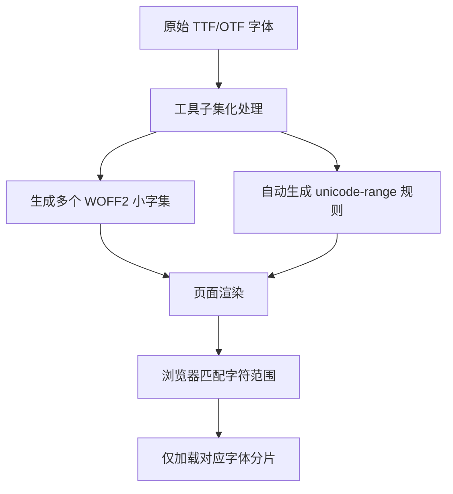

出处：[掘金](https://juejin.cn/post/7621817220135125002)

原作者：李剑一

---

最近在做一个公网的小项目，本身是一个在线的海报编辑器，因为之前做的比较糙，最近有时间了，领导让优化一下。问题主要集中在页面的加载速度上

设计稿要求多字体质感、标题正文差异化排版，结果引入的字体包动辄几 MB，中文字体甚至直奔 10MB+

页面首屏加载非常慢，但是删字体包设计那边过不去，不删吧用户等待时间过长，体验直线下滑，简直两难

# 核心问题

先明确我们到底在解决什么问题，避免盲目优化

其实主要几个问题：

- **字体体积冗余**：完整字体包包含上万字符，项目实际用到的不过几百个，甚至有可能就几个字，全量加载纯纯浪费
- **阻塞页面**：字体包过大，加载过程中可能触发 FOIT（文字隐形）、FOUT（文字闪烁），页面出现留白卡顿
- **多字体加载混乱**：一个页面同时存在多种字体包同时引入的时候，基本上就是谁在前面加载谁，无规划加载拖慢整体渲染
- **格式不兼容**：沿用 TTF/OTF 老式字体格式，体积大、压缩率低，完全适配不了现代前端性能要求

但是格式问题需要注意，新式的字体包，比如说 WOFF2，是不支持 IE 这种较老版本的浏览器的 —— 如果你有兼容需求，记得不要上新包

# 解决方案

## 建议字体包转 WOFF2

前提是你只要没有兼容性需求，几乎 `WOFF2` 是**必转**的

- 相比于传统 TTF、OTF、WOFF 格式，WOFF2 是现代浏览器专属的字体压缩格式，体积能直接缩减**50%-70%**
- 而且 Chrome、Edge、Safari、Firefox 全版本兼容，完全不用担心兼容性问题

可以用 Font Squirrel 在线工具进行一键转换，或者直接让 UI 那边导出来 WOFF2 的包

## 按场景拆分字体包

多字体包的情况下千万别全量引入，一定要按照**使用频率、使用场景**拆分：高频使用的优先处理，低频使用的单独拆分，延后加载

可以在引入的部分，按照字重、字体样式拆分 `@font-face`

这样的好处在于浏览器只会加载**当前页面用到的字体规则**，不会全量请求所有字体包

```css
/* 按字重拆分，按需加载 */
@font-face {
  font-family: 'SourceHanSans';
  src: url('./fonts/regular.woff2') format('woff2');
  font-weight: 400;
}
@font-face {
  font-family: 'SourceHanSans';
  src: url('./fonts/bold.woff2') format('woff2');
  font-weight: 700;
}
```

### 延迟加载

另外文字留白、闪烁问题，核心就是靠 `font-display` 属性

使用 `font-display: swap` 浏览器会先使用系统默认字体展示页面文字，等到自定义字体加载完成后，再无缝替换。

全程不会出现文字隐形、页面卡顿的情况，让用户感知上有一种等一小会儿的感觉

还有就是可视区域以外的字体，完全没必要和首屏一起加载，等到页面加载完成、或者用户触发对应模块时，再加载字体即可，减少首屏的请求数量

```js
// 页面加载完成后，懒加载非首屏字体
window.addEventListener('load', () => {
  const link = document.createElement('link');
  link.rel = 'stylesheet';
  link.href = '/css/other-font.css';
  document.head.appendChild(link);
})
```

# 终极方案：字体子集化&按需加载

前面主要是给字体"**减负**"，**字体子集化和按需加载**就是直接给字体"**瘦身**"

据我所知，这也是目前谷歌、阿里、腾讯等大厂通用的天花板方案，能够彻底解决字体冗余问题

## 核心原理

完整字体包中包含海量未使用字符，这样我们其实可以通过工具提取项目**实际用到的字符**

将大字体拆分成多个极小的字体分片；再通过 CSS 的 `unicode-range` 告诉浏览器，哪些字符对应哪个字体分片

浏览器只会加载当前页面用到的分片，没用到的完全不请求。相当于是对通过**拆字**的方式实现了对字体包的懒加载

简单画一个流程图：



这套方案下来，原本几 MB 的字体，能直接压缩到几十 KB，首屏字体加载速度提升数十倍，还完全不影响多字体使用

## 具体实现

这里我推荐几个我用过的：`glyphhanger`、`fontmin`、`vite-plugin-fontmin`

### `glyphhanger`

基于 Node.js，无需手动提取字符，直接爬取页面文字，自动生成子集字体+unicode-range CSS，适合快速优化现有页面，新手也能一键上手

```shell
# 全局安装
npm install -g glyphhanger
# 一键生成子集字体与 CSS
glyphhanger http://localhost:3000 --formats=woff2 --subset=./src/fonts/xxx.ttf
```

### `fontmin`

纯 JavaScript 实现，无额外环境依赖，支持自定义提取字符、批量处理，可嵌入 Webpack、Gulp 等构建流程，适合需要定制化优化的项目

```js
const Fontmin = require('fontmin')
new Fontmin()
  .src('./src/fonts/xxx.ttf')
  .use(Fontmin.glyph({ text: '项目实际用到的文字', hinting: false }))
  .use(Fontmin.ttf2woff2())
  .dest('./dist/fonts')
  .run()
```

### `vite-plugin-fontmin`

Vue 3 + Vite 项目专属

```shell
# 安装插件
npm install vite-plugin-fontmin -D
# 或者yarn/pnpm
pnpm add vite-plugin-fontmin -D
```

**配置文件**，这里写的比较全，包含字体优化、资源打包、开发环境优化等等，可根据项目字体自行修改

```js
import { defineConfig } from 'vite'
import vue from '@vitejs/plugin-vue'
import path from 'path'
// 引入字体子集化插件
import fontminPlugin from 'vite-plugin-fontmin'

export default defineConfig({
  // 路径别名
  resolve: {
    alias: {
      '@': path.resolve(__dirname, './src')
    }
  },
  // 插件配置
  plugins: [
    vue(),
    // 字体子集化核心配置
    fontminPlugin({
      // 配置多个字体（单字体直接写单个对象即可）
      fonts: [
        {
          // 源字体文件路径（放入项目src/fonts目录下）
          fontSrc: './src/fonts/SourceHanSansCN-Regular.ttf',
          // 子集化后字体的输出目录
          fontDest: './src/assets/fonts/subset/',
          // 自动扫描项目文件，提取所有用到的字符（无需手动书写）
          inputPath: ['./src/**/*.{vue,ts,tsx,js,jsx,css,scss}'],
          // 额外预留字符（动态内容、用户输入、接口返回文字，提前预留）
          input: '0123456789qwertyuiopasdfghjklzxcvbnm，。！？；：“”‘’',
          // 仅输出WOFF2格式
          formats: ['woff2'],
          // 开启unicode-range按需加载（核心）
          unicodeRange: true,
          // 字体渲染规则，避免阻塞
          fontDisplay: 'swap',
          // 关闭字体提示，进一步压缩体积
          hinting: false
        },
        // 多字体配置示例（标题字体，按需添加）
        {
          fontSrc: './src/fonts/TitleFont-Bold.ttf',
          fontDest: './src/assets/fonts/subset/title/',
          inputPath: ['./src/components/Title/**/*.vue', './src/views/**/*.vue'],
          formats: ['woff2'],
          unicodeRange: true,
          fontDisplay: 'swap'
        }
      ],
      // 开发环境仅执行一次子集化，避免热更新卡顿
      runOnceInDev: true,
      // 生产环境压缩字体
      compress: true
    })
  ],
  // 生产构建配置
  build: {
    assetsDir: 'static/assets',
    // 字体资源单独打包，方便缓存
    rollupOptions: {
      output: {
        assetFileNames: (assetInfo) => {
          if (assetInfo.name && assetInfo.name.endsWith('.woff2')) {
            return 'static/assets/fonts/[name]-[hash][extname]'
          }
          return 'static/assets/[name]-[hash][extname]'
        }
      }
    },
    // 关闭生产环境sourcemap，提升打包速度
    sourcemap: false,
    // 代码压缩
    minify: 'terser'
  },
  // 开发服务器配置
  server: {
    port: 3000,
    open: true
  }
})
```

完成上述配置以后，插件会自动生成对应的 `@font-face` 规则，无需手动引入字体 CSS，直接在项目样式里使用即可

```css
/* src/assets/css/global.css */
body {
  font-family: 'SourceHanSansCN', sans-serif;
}
.title {
  font-family: 'TitleFont', sans-serif;
  font-weight: 700;
}
```

# 总结

其实字体优化一直是老大难问题，不上字体包效果出不来，上了字体包加载速度上不来。当然，我们仍然建议，非必要不要上字体包

还有一个"邪修"方案，可以手动创建**字体包子集**，也就是说这个字体包只包含要用字，其他的删掉（参考 iconFont 的字体库"下载子集"）

如果非要上，那就是所有字体转 WOFF2，拆分字体包，添加 `font-display: swap`

另外再增加**字体子集化**和按需加载的部分，让首屏加载快起来
