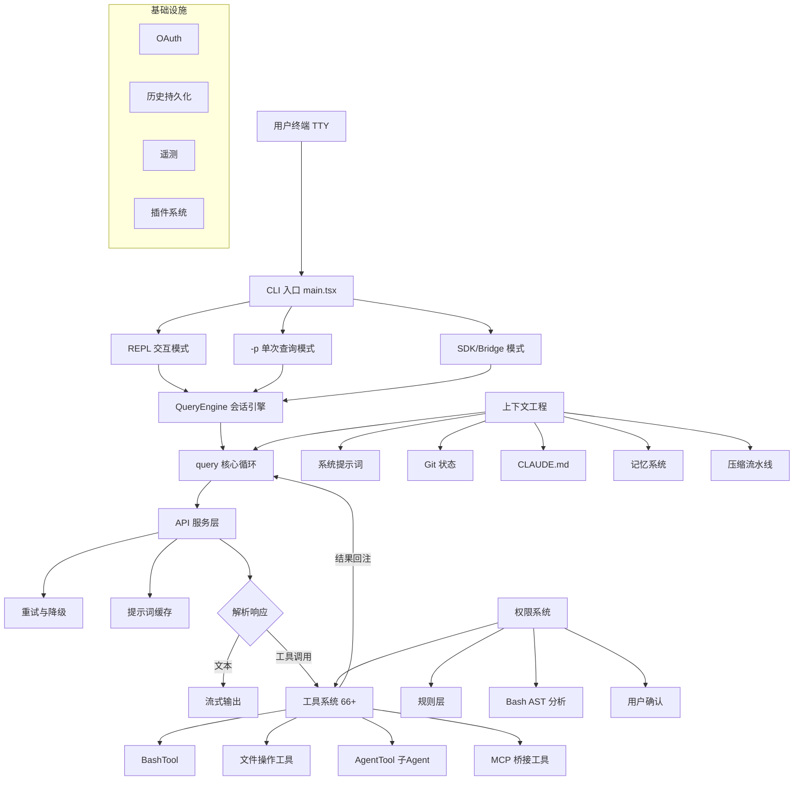
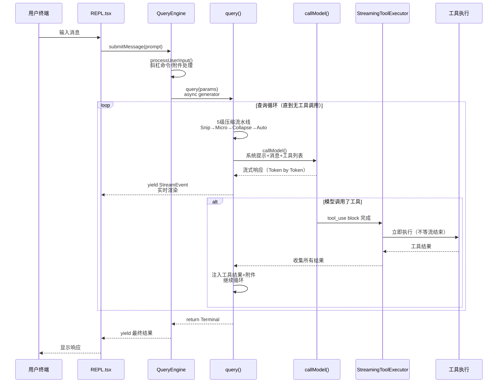

# Claude Code 是什么

Claude Code 是 Anthropic 的 CLI 编程 Agent。一个**受控工具循环 Agent** —— 能理解代码库、编辑文件、执行命令、管理 git 的自主编程助手

作为一个日活百万级开发者实际使用的生产系统，Claude Code 解决的不是"如何调用大模型 API"这个简单问题，而是一系列工程挑战：

- **如何让 Agent 自主完成复杂任务？** → Agent Loop 的多轮决策与错误恢复
- **如何在有限的上下文窗口里高效工作？** → 5 级渐进式上下文压缩
- **如何让 AI 安全地执行 Shell 命令？** → 7 层纵深防御 + AST 级命令分析
- **如何让 Agent 跨会话学习？** → 记忆系统 + 技能系统
- **如何处理超出单 Agent 能力的任务？** → 3 种多 Agent 协作模式

这些问题的答案构成了一套完整的 **Agent 工程方法论** —— 这正是本系列文档想帮你理解的

## 从工具到 Agent：三级范式

1. **第一级：代码补全**（如 Copilot）
	- 模型的工作是"预测下一行代码"。它看到你的光标位置和上下文，生成一个补全建议
	- 这本质上是一个**单次预测问题** —— 模型不需要理解整个项目，不需要执行任何操作，只需要根据局部上下文生成合理的代码片段
2. **第二级：聊天助手**（如 Cursor Chat、Copilot Chat）
	- 用户可以用自然语言描述需求，模型生成代码片段或修改建议
	- 这比补全强大 —— 模型可以看到更多上下文，可以生成多个文件的修改
	- 但关键限制是：**模型不能执行操作**。它生成一个 diff，由用户决定是否 apply。如果 diff 有问题，用户需要手动发现并反馈，模型无法自行验证
3. **第三级：自主 Agent**（Claude Code）
	- 模型不仅生成代码，还能**自主执行多步操作**

考虑一个真实场景：你想给项目添加一个新的 REST endpoint（后端 API 接口）

- Copilot 会给你一个函数体
- 聊天助手可能会建议一个修改方案
- 而自主 Agent 的做法是：
	- 先用 Grep 搜索现有路由定义理解项目的路由模式，用 FileRead 读取中间件配置
	- 然后创建 handler 文件、注册路由、编写测试
	- 接着运行 `npm test` 发现测试失败，读取错误信息，修复代码，再次运行测试直到通过
	- 最后提交 git commit

整个过程是一个**自主决策循环** —— 模型决定下一步做什么，执行后观察结果，再决定下一步

## "Agent-first" 的架构含义

"Agent-first" 不是营销口号，它有具体的架构含义：**模型是循环中的决策者**。人类设定目标（"给这个项目添加用户认证"）并审批危险操作（"确认执行 `npm install`？"），但在两次人类交互之间，模型自主决定读什么文件、改什么代码、执行什么命令

这体现在源码中最核心的一行 —— `src/query.ts:307` 的 `while (true)`：

```ts
// src/query.ts:307
while (true) {
    // ... 压缩 → API 调用 → 工具执行 → 继续/退出
}
```

这个循环**只有当模型的响应不包含任何工具调用时才会退出**。换句话说，模型（而不是代码逻辑）决定任务是否完成。代码只是提供了执行环境，真正的"大脑"是模型本身

# 架构总览



## 入口层（`main.tsx`）

CLI 入口处理截然不同的运行模式

关键设计是：**不同模式全部汇聚到同一个 `QueryEngine`**。这意味着核心 Agent 循环是模式无关的 —— 无论 Claude Code 是被人类交互使用、被 CI 脚本以 `-p` 调用、还是被 IDE 插件通过 SDK 集成

### REPL/TUI（交互式终端）

> [!question] REPL 是什么
> 
> REPL 是 Read–Eval–Print Loop 的缩写，指一种交互式运行方式：
> 
> 1. Read（读）：读入你输入的一行/一段代码或命令
> 2. Eval（求值）：解释或执行
> 3. Print（打印）：把结果输出给你看
> 4. Loop（循环）：再回到「读」，可以连续输入
> 
> 典型例子：Python 里敲 `python` 进到的交互界面、Node 里的 `node`、各种语言的交互 shell，都是 REPL 这种模式
> 
> 在 Claude Code 的终端 AI 工具里，说「启动 REPL」通常就是指：启动交互式会话界面（Ink TUI 里能输入、能看模型回复的那个循环），和「 `-p` 打一条就退出」的非交互模式相对

关键函数：

```ts
// src/replLauncher.tsx
export async function launchRepl(
  root: Root,
  appProps: AppWrapperProps,
  replProps: REPLProps,
  renderAndRun: (root: Root, element: React.ReactNode) => Promise<void>
): Promise<void>
```

这个函数动态加载 `App + REPL` 组件后启动 Ink 渲染循环。`REPL.tsx` 维护完整的 `AppState`（消息、输入框、权限弹窗、任务、远程状态）

### Headless / SDK

如 Print 模式（`-p` 标志，单次查询后退出）

不依赖 Ink/React 渲染，直接实例化 `QueryEngine`

### Remote / Bridge

供第三方程序调用，这使 Claude Code 从"本地终端工具"扩展成"本地与远程混合 agent 平台"

```ts
// src/bridge/bridgeMain.ts 结构伪代码
async function runBridge(config: BridgeConfig) {
  const ws = connectToRemoteOrchestrator(config.orchestratorUrl)
  ws.on('session-start', (session) => spawnLocalAgent(session))
  ws.on('heartbeat', () => sendHeartbeat())
  ws.on('disconnect', () => scheduleReconnect())
}
```

###  MCP Server

```ts
// src/entrypoints/mcp.ts 结构伪代码
async function startMcpServer() {
  const server = new McpServer({ name: 'claude-code', version })
  // 把内部 Tool（FileEdit, FileRead, Bash...）重新包装为 MCP tool schema
  for (const tool of getInternalTools()) {
    server.registerTool(tool.name, tool.inputSchema, wrapToolAsMcpHandler(tool))
  }
  await server.connect(new StdioServerTransport())
}
```

这条路径让 Claude Code **既能作为 MCP client 消费外部能力，也能作为 MCP server 对外暴露能力**

## 会话层（QueryEngine）

管理一次对话的完整生命周期：

- 消息持久化（每次交互自动保存）
- 成本追踪（累计 token 和美元开销）
- 预算执行（task budget 限额）
- 结构化输出重试
- ……

它是"用户交互"和"Agent 执行"之间的边界。当一条新消息到达时，`QueryEngine` 判断它是斜杠命令、文件附件还是普通 prompt，做相应的预处理后才转交给核心循环

## 核心循环（query）

这是 Claude Code 的心脏。一个 `while(true)` 循环反复执行：压缩上下文 → 调用 API → 执行工具 → 判断是否继续

循环携带可变的 `State` 对象（`query.ts:204`），包括消息历史、压缩追踪状态、输出 token 恢复计数、turn 计数等

循环有 7 个不同的"继续点"（Continue Sites），分别处理正常工具循环、上下文过长恢复、压缩触发重试等场景

## 服务层（API + 工具 + 上下文）

三个独立的子系统，由核心循环编排协调

- API 服务处理模型通信（流式传输、重试策略、提示词缓存）
- 工具系统提供 66+ 种能力（文件操作、搜索、Agent 派生、MCP 桥接）
- 上下文系统负责构建系统提示词、注入 `CLAUDE.md` 内容、管理 git 状态信息

三者之间互不依赖

## 权限层

主要是对工具调用进行权限控制，采用**纵深防御（Defense in Depth）** 策略。多个独立的安全层共同保护用户环境

[[011.权限与安全|权限与安全]]

## 基础设施层（OAuth、History、Telemetry、Plugins）

横切关注点，支撑所有其他层但不参与主循环

- OAuth 处理认证
- History 提供对话持久化和恢复（`claude --resume`）
- Telemetry（懒加载，~400KB+）追踪使用数据
- Plugins 扩展工具和 Hook

## 单向依赖

这个分层有一条关键的依赖规则：

- 核心循环（`query.ts`）依赖服务层，但永远不依赖 UI 层
- UI 层（`REPL.tsx`）依赖 `QueryEngine`，但永远不直接依赖 `query.ts`

这意味着你可以把整个终端 UI 替换为 Web UI，只需要重写 REPL 层 —— `QueryEngine` 及其以下的所有模块完全不用改动

SDK 模式就是这个设计的直接体现：它绕过了整个 UI 层，直接与 `QueryEngine` 交互

# 数据流全景

理解 Claude Code 的关键是理解**数据如何在各层之间流动**。下面是一次完整的用户交互的数据流：



1. **用户输入进入 REPL**：React 组件 `REPL.tsx` 捕获用户的文本输入
	- 如果是斜杠命令（如 `/clear`、`/compact`），在本地直接处理，永远不会发送到 API
	- 普通消息则传递给 `QueryEngine.submitMessage()`
2. `processUserInput()` **处理消息**中的附件（图片缩放、文件引用解析），构建包含消息历史、系统提示词、工具列表和权限上下文的 `QueryParams` 对象，然后调用 `query()` 启动核心循环
3. **五级压缩管道运行**：压缩不是只在对话开始时运行一次，而是**在每次 API 调用之前都会运行**
	- 循环的每一轮迭代都会依次检查[[002.系统主循环#1. 五级压缩流水线|五级压缩流水线]]，按需触发
	- 大多数迭代中没有任何压缩触发（上下文还没满），但当历史消息累积到接近上下文窗口上限时，压缩管道会自动介入
4. **API 调用**：
	- 系统提示词、压缩后的消息历史和工具 schema 被发送到 Claude API（通过 `services/api/claude.ts` 的 `queryModelWithStreaming()`）
	- 响应以 token-by-token 的方式流式返回，每个 token 被 `yield` 为 `StreamEvent` 沿着 generator 链向上传递到 UI，用户立即看到文字出现
5. **工具在流式过程中即开始执行**：
	- 这是 Claude Code 的一个重要性能优化：`StreamingToolExecutor` **不等待模型的完整响应**
	- 当流式解析器检测到一个 `tool_use` JSON block 已经完整，工具执行立即开始 —— 此时模型可能还在继续生成后面的文字或其他工具调用
	- 只读且并发安全的工具（如 Grep、Glob）甚至可以**并行执行**，进一步缩短多工具调用的总耗时
6. **结果注入，循环继续**：
	- 工具的执行结果被封装为 `tool_result` 消息追加到对话历史中
	- 循环回到 Step 3 —— 再次检查是否需要压缩，再次调用 API。模型看到工具结果后决定下一步：继续调用更多工具，或者生成最终的文字回复
7. **循环退出，结果组装**：当模型的响应中不包含任何 `tool_use` block 时，`query()` 返回一个 `Terminal` 值。`QueryEngine` 组装最终结果，持久化对话历史，更新 usage/cost 追踪

## 关于性能：流式工具预执行

Step 5 中的"流式工具预执行"值得单独强调。在朴素的实现中，流程是串行的：等待模型完整响应 → 解析工具调用 → 顺序执行工具 → 发送结果

Claude Code 的流程是重叠的：模型还在生成文字的同时，已解析完成的工具调用已经在执行。对于一次包含 3-4 个工具调用的响应，这种重叠可以显著减少端到端延迟

[[012.用户体验设计#流式输出|流式输出]]

## 关于错误恢复

数据流中隐藏着多层错误恢复机制：

- **API 错误**（429 限速、529 服务过载）：`withRetry` 层自动进行指数退避重试，严重情况下可以降级到备选模型
- **上下文过长**（`prompt_too_long`）：触发 reactive compact —— 紧急执行一轮压缩然后重试 API 调用
- **工具执行失败**：
	- 错误信息被包装为 `tool_result`（标记 `is_error: true`）返回给模型，模型可以自行决定是重试还是换一种方法
	- `yieldMissingToolResultBlocks()`（`query.ts:123`）确保每个 `tool_use` 都有对应的 `tool_result`，即使在中断场景下也不会出现消息配对缺失

关键洞察：**数据通过嵌套的 async generator 流动**。每一层都在 generator 管道上添加自己的处理逻辑（权限检查、压缩、错误恢复），但对上层来说，它只是一个统一的事件流。这使得关注点完全分离：

- `QueryEngine` 不需要知道压缩细节
- REPL 不需要知道错误恢复逻辑

# 启动流程

Claude Code 的启动经过精心优化，将大量工作并行化和延迟化，关键路径仅约 **235ms**

## 总目标：最小化用户感知的启动时间

关键路径优化的是：从执行 `claude` 到 REPL 第一次能渲染、能接受输入这段时间。很多工作（统计、部分预取、遥测大包）故意不挡在这条路上

- **并行预取**：MDM（移动设备管理）策略读取和 Keychain 凭证预取在模块加载的同时就并行启动，而不是等加载完成后串行执行
- **延迟非关键任务**：用户信息查询、文件计数统计、模型能力检测 —— 这些对首次交互不重要的操作被推迟到首帧渲染之后
- **懒加载重依赖**：OpenTelemetry（~400KB+）在用户完成 Trust Dialog 之后才加载，避免拖慢启动速度

一句话：启动被拆成「能立刻退出的超短路径 → 与 import 重叠的 I/O 预取 → 一次性的 memoized `init` → 先出界面再补全统计/遥测」，关键路径大约两百多毫秒，而体感主要取决于你何时完成信任对话框、网络与磁盘，而不等于「所有模块和遥测都加载完」

## 轻量入口：`cli.tsx` 做早期分流

这一层是"入口分流器"，不是完整应用。职责是：识别快路径并提前退出，避免启动完整应用

**伪代码（基于源文件结构）**：

```ts
// src/entrypoints/cli.tsx 结构伪代码
async function main() {
  const argv = parseArgs(process.argv)

  // 快路径分流 —— 命中则执行并退出，不进入 main.tsx
  if (argv['--version']) {
    // 查看版本
    console.log(version); process.exit(0)
  }
  if (argv['--dump-system-prompt']) {
    // 导出系统提示词
    await dumpSystemPrompt(); process.exit(0)
  }
  if (argv['remote-control']) {
    // 远程控制
    return runRemoteControl(argv)
  }
  if (argv['daemon'] || argv['bg'] || argv['runner']) {
    // 运行守护进程或后台
    return runDaemonOrBackground(argv)
  }

  // 兜底：进入完整主启动器
  await import('./main.tsx').then(m => m.main(argv))
}
```

这种设计的好处：普通快速命令不需要加载整个应用（React、Ink、MCP 等），启动速度快且副作用少。

## 模块加载并行预取

`main.tsx` 最前面就做两件与「后面要读配置/凭证」相关的事（为后面 `preAction` 里 `await` 时「几乎不用再等」做准备），和后面一大堆 `import`（主线程加载 Commander、analytics、auth 等）并行执行：

- MDM：企业「远程管理策略」相关读取（子进程跑 `plutil` / `reg` 等）
- Keychain 预取：macOS 上两把钥匙串读取若串行可能要几十毫秒；这里并行起子进程，后面真正用时往往已命中预取（`keychainPrefetch.ts`）

```ts
// These side-effects must run before all other imports:
// 1. profileCheckpoint marks entry before heavy module evaluation begins
// 2. startMdmRawRead fires MDM subprocesses (plutil/reg query) so they run in
//    parallel with the remaining ~135ms of imports below
// 3. startKeychainPrefetch fires both macOS keychain reads (OAuth + legacy API
//    key) in parallel — isRemoteManagedSettingsEligible() otherwise reads them
//    sequentially via sync spawn inside applySafeConfigEnvironmentVariables()
//    (~65ms on every macOS startup)

// 这些副作用必须在所有其他导入之前运行：
// 1. profileCheckpoint 在开始对复杂模块进行评估之前标记入口
// 2. startMdmRawRead 会触发 MDM 子进程（plutil/reg 查询），使其与下面剩余的 ~135ms 导入并行运行
// 3. startKeychainPrefetch 会并行触发 macOS 密钥串的两次读取操作（OAuth + 旧版 API 密钥）———
//    否则，isRemoteManagedSettingsEligible() 会通过 applySafeConfigEnvironmentVariables() 中的 sync 进程依次读取它们
//   （每次 macOS 启动时约需 65 毫秒）
import { profileCheckpoint, profileReport } from './utils/startupProfiler.js';

profileCheckpoint('main_tsx_entry');
import { startMdmRawRead } from './utils/settings/mdm/rawRead.js';

startMdmRawRead();
import { ensureKeychainPrefetchCompleted, startKeychainPrefetch } from './utils/secureStorage/keychainPrefetch.js';

startKeychainPrefetch();
```

## 主启动器：`main.tsx` 是系统编排中心

一旦要走完整 CLI，会 `import main`，`main.tsx` 实际上是**总控入口**，负责所有主路径初始化。从其 `import` 列表可以直接推断职责范围（以下是源码 import 的精简摘录）：

```ts
// src/main.tsx —— 关键 import 反映职责范围
import { init, initializeTelemetryAfterTrust } from './entrypoints/init.js'
import { launchRepl } from './replLauncher.js'
import { fetchBootstrapData } from './services/api/bootstrap.js'
import { getMcpToolsCommandsAndResources } from './services/mcp/client.js'
import { getTools } from './tools.js'
import { getAgentDefinitionsWithOverrides } from './tools/AgentTool/loadAgentsDir.js'
import { initBundledSkills } from './skills/bundled/index.js'
import { showSetupScreens, exitWithError } from './interactiveHelpers.js'
import { settingsChangeDetector } from './utils/settings/changeDetector.js'
// ... 还有约 80 个 import
```

**主流程伪代码**：

```ts
// src/main.tsx 主流程（伪代码）
export async function main(argv: ParsedArgs) {
  // 1. 早期初始化（不依赖 trust）
  await init(argv)

  // 2. 解析 CLI 参数 -> 确定 permission mode、模型、工具等
  const permissionMode = initialPermissionModeFromCLI(argv)
  const model = resolveModel(argv)

  // 3. 条件分支：选择执行路径
  if (argv['--print'] || argv['--sdk']) {
    return runHeadless(argv, model, permissionMode)
  }
  if (argv['bridge']) {
    return runBridge(argv)
  }
  if (argv['remote']) {
    return runRemote(argv)
  }

  // 4. 默认路径：初始化完整运行时后进入 REPL
  const bootstrap = await fetchBootstrapData()          // 拉取远端配置
  const mcpTools  = await getMcpToolsCommandsAndResources() // 连接 MCP
  const tools     = getTools(permissionContext)          // 组装工具池
  const skills    = initBundledSkills()                  // 加载内置技能
  const agents    = getAgentDefinitionsWithOverrides()   // 加载 agent 定义

  await initializeTelemetryAfterTrust()                 // trust 后才启动 telemetry（遥测）

  settingsChangeDetector.start()                        // 监听配置文件热更新

  // 5. 进入 REPL
  await launchRepl(root, appProps, replProps, renderAndRun)
}
```

**`init.ts`**：`src/entrypoints/init.ts` —— **逻辑初始化**

```ts
// src/entrypoints/init.ts 结构伪代码
export const init = memoize(async (): Promise<void> => {...
  applySafeEnvironmentVariables()    // 只应用安全的 env var（trust 前）
  initializeCertificates()           // 证书与 HTTPS 代理
  initializeHttpAgent()              // HTTP agent 配置
  initTelemetrySkeleton()            // 注册 telemetry sink（遥测接收器），但不发事件
  // Note: initializeTelemetryAfterTrust() 在 trust 建立后由 main.tsx 调用
})

export async function initializeTelemetryAfterTrust() {
  applyFullEnvironmentVariables()    // trust 通过后才应用全部 env var
  attachAnalyticsSink()              // 开始处理 telemetry 事件队列
}
```

`init` 用 `lodash` 的 `memoize` 包了一层 —— 无论多少处写 `await init()`，真正的初始化体只执行一次；重复调用得到的是缓存的 Promise，不会重复跑副作用

trust 建立前只应用安全的环境变量，防止"配置文件/includes 本身是攻击面"的风险

**`setup.ts`**：`src/setup.ts` —— **运行环境初始化**

```ts
// src/setup.ts 结构伪代码
export async function setup(argv, permissionContext) {
  setCwd(resolvedWorkingDir)         // 设置工作目录
  startHooksWatcher()                // 监听 hooks 配置变化
  initWorktreeSnapshot()             // tmux/worktree 快照
  initSessionMemory()                // 初始化 session memory 系统
  startTeamMemoryWatcher()           // 启动 team memory 文件监听
}
```

| 函数          | 何时执行                                                                                                 |
| ----------- | ---------------------------------------------------------------------------------------------------- |
| `init()`    | 任意会触发 `preAction` 的命令：解析完成后、该命令的 `action` 之前                                                         |
| `setup()`   | 仅默认主命令的 `action` 内，在权限上下文/工具等准备好之后；子命令一般不调用                                                          |
| 全量 env + 遥测 | 交互：trust（及 `showSetupScreens` 相关流程）之后；`-p`：在同一 `action` 里较早分支中直接应用并调 `initializeTelemetryAfterTrust` |

# 技术栈

| 层次        | 技术选型                                               | 说明                                           |
| --------- | -------------------------------------------------- | -------------------------------------------- |
| 运行时       | Bun                                                | 高性能 JS/TS 运行时，支持编译时 Feature Flag 消除          |
| 语言        | TypeScript                                         | 全量 TypeScript，严格类型检查                         |
| UI 框架     | React + [Ink](https://github.com/vadimdemedes/ink) | 基于 React 的终端 UI 框架，Ink 渲染器（`src/ink/`，251KB） |
| 布局引擎      | [Yoga](https://github.com/facebook/yoga)           | Facebook 的 Flexbox 布局引擎，适配终端                 |
| Schema 验证 | Zod                                                | 运行时类型校验，用于工具输入、Hook 输出、配置验证                  |
| CLI 框架    | Commander.js                                       | 命令行参数解析，分发到 REPL/headless/SDK 模式             |
| API 协议    | Anthropic SDK                                      | 官方 TypeScript SDK，支持流式响应                     |

技术选型本身不是本文重点，但有两个选择值得一提，因为它们深刻影响了架构设计：

- **Bun 的 `feature()` 宏**：Claude Code 内部有大量功能（协调器模式、Swarm 团队等）在外部发布版本中需要完全移除。Bun 提供的编译时 Feature Flag 让这些代码在构建时被物理删除，而非运行时隐藏。这在后续"编译时 Feature Gate"设计原则中会详细展开
- **自研 React 终端渲染器**：Claude Code 的终端 UI 复杂度远超普通 CLI——权限确认对话框、流式代码高亮、嵌套工具进度指示器都需要组件化的状态管理。团队维护了一个 251KB 的定制 Ink 渲染器（[[012.用户体验设计#Ink/React 终端 UI|Ink/React 终端 UI]]）

# 源码目录结构

Claude Code 源码约 1,900 文件、512K+ 行 TypeScript，目录结构如下：

```txt
src/
├── main.tsx                 # CLI 主入口（4,683 行）
│                            # Commander.js 解析参数，分发到 REPL/headless/SDK 模式
├── QueryEngine.ts           # 会话引擎（1,155 行）
│                            # 管理对话全生命周期：消息持久化、预算追踪、结果组装
├── query.ts                 # 核心查询循环（1,728 行）
│                            # 单次查询的状态机：压缩→API调用→工具执行→恢复/继续
├── Tool.ts                  # 工具接口定义
│                            # 所有工具（内置/MCP/插件）的统一类型约束
├── tools.ts                 # 工具注册与组装
├── context.ts               # 上下文构建（190 行）
│                            # getSystemContext/getUserContext：Git状态、CLAUDE.md、日期
│
├── bootstrap/               # 全局状态管理
│   └── state.ts             # 集中式状态存储（1,758 行，150+ getter/setter）
│                            # 所有子系统通过访问器读写共享状态，避免 import 循环
│
├── entrypoints/             # 入口点
│   ├── init.ts              # 核心初始化（341 行）：14 步幂等初始化
│   ├── cli.tsx              # 快速路径（--version, MCP server, bridge）
│   └── sdk/                 # SDK 入口与类型
│
├── screens/                 # 主要界面
│   ├── REPL.tsx             # 主对话 UI（895KB）：消息渲染、输入处理、状态管理
│   ├── Doctor.tsx           # 诊断界面
│   └── ResumeConversation.tsx
│
├── tools/                   # 66+ 内置工具
│   ├── BashTool/            # Shell 命令执行（含 AST 安全分析）
│   ├── AgentTool/           # 子 Agent 派生（支持 worktree 隔离）
│   ├── FileReadTool/        # 文件读取（支持图片、PDF、Notebook）
│   ├── FileEditTool/        # 文件编辑（search-and-replace 策略）
│   ├── GrepTool/            # 内容搜索（基于 ripgrep）
│   ├── GlobTool/            # 文件匹配
│   ├── WebFetchTool/        # 网页获取
│   ├── SkillTool/           # 技能调用
│   └── ...                  # 更多工具
│
├── services/
│   ├── api/                 # API 客户端层
│   │   ├── claude.ts        # 核心查询逻辑（3,419 行）
│   │   │                    # HTTP→Claude API 的桥梁：prompt 构建、缓存控制、
│   │   │                    # thinking 配置、task budget 注入、流式响应解析
│   │   ├── withRetry.ts     # 重试策略（指数退避 + 模型降级）
│   │   └── promptCacheBreakDetection.ts  # 缓存断裂检测与自动归因
│   ├── compact/             # 压缩系统
│   │   ├── autoCompact.ts   # 自动压缩触发（阈值计算、条件判断）
│   │   └── compact.ts       # 摘要生成引擎（1,705 行）
│   │                        # fork 子 Agent 生成对话摘要，压缩后恢复最近文件和技能
│   ├── mcp/                 # MCP 协议集成（7 种传输）
│   ├── oauth/               # OAuth 2.0 + PKCE
│   ├── plugins/             # 插件系统
│   └── lsp/                 # 语言服务器协议
│
├── hooks/                   # 权限与 Hook 处理
│   └── toolPermission/      # 工具权限判定
│       └── handlers/        # 3 种权限处理器：规则匹配、Hook、用户确认
│
├── coordinator/             # 多 Agent 协调器（内部功能，Feature-gated）
├── memdir/                  # 记忆系统（~/.claude/memory/ 管理）
├── skills/                  # 技能系统（18+ 内置技能）
├── ink/                     # 自定义终端渲染器（251KB 核心，React→终端输出）
├── vim/                     # Vim 模式
├── schemas/                 # Zod Schema 定义
└── utils/                   # 通用工具库
    ├── hooks.ts             # Hook 执行引擎
    ├── bash/                # Bash AST 解析（tree-sitter）
    ├── messages.ts          # 消息处理（5,512 行）：规范化、压缩边界、格式转换
    └── tokens.ts            # Token 估算与追踪
```

# 从源码中发现的关键设计

> 以下内容均来自对源码的实际分析，不是猜测

## 为什么 Claude Code 用起来感觉那么快？

它其实做了三件聪明的事：

1. **全链路流式输出**：不是等模型全部想完再显示，而是每生成一个 token 就立刻展示。从 API 调用到终端渲染，整条链路都是流式的
2. **工具预执行**：模型说"我要读某个文件"的时候，这个文件其实已经在读了。系统在模型还在输出的同时就开始解析和执行工具调用，利用模型生成的 5-30 秒窗口，把约 1 秒的工具延迟藏起来了
3. **并行启动**：启动时把不相关的初始化任务并行执行，关键路径压到约 235ms

## Generator-based 流式架构

从 API 调用到 UI 渲染，全链路使用 `async function*` 异步生成器。这不是简单的 callback 或 Promise 链，而是真正的流式处理管道，每个 Token、每个工具结果都能实时流向用户界面

核心查询循环的签名是：

```ts
// src/query.ts
export async function* query(
  params: QueryParams,
): AsyncGenerator<StreamEvent | Message | ToolUseSummaryMessage, Terminal>
```

这是一个异步生成器 —— 它不是一次性返回结果，而是**边执行边 `yield` 事件**。调用方（`QueryEngine`）通过 `for await (const msg of query(params))` 实时消费每一个事件：模型输出的每个 Token、每个工具调用的结果、压缩事件、错误恢复 —— 所有这些都通过同一个 generator 管道流向 UI 层

这种设计的好处是**零缓冲延迟**：用户在模型开始生成的瞬间就能看到输出，而不需要等待整个响应完成

**为什么是 Generator 而不是 Callback 或 Promise？**

- **Callback 模式**：经典 Node.js 风格，容易陷入 "callback hell"
	- 更重要的是无法优雅地传递 backpressure（背压），当 UI 渲染跟不上数据产生速度时，没有自然的暂停机制
	- 当用户按 Ctrl+C 中断时，需要手动在每一层 callback 中接线取消逻辑
- **Promise/async-await 模式**：
	- 解决了 callback hell，但 `await` 是阻塞式的 —— 一个 `await apiCall()` 必须等到整个响应完成才能返回
	- 要实现流式，你需要手动缓冲部分结果并轮询，这本质上是在 Promise 之上重新发明 generator 
- **Generator 模式**：`yield` 天然就是流式语义
	- 生产者（API 层）产出一个 token 就 `yield` 一次，消费者（UI 层）按自己的节奏拉取
	- 更关键的是，`generator.return()` 可以**级联清理整个调用链**：用户按 Ctrl+C → REPL 调用 `generator.return()` → `QueryEngine` 的 generator 终止 → `query()` 的 generator 终止 → API 请求被 abort
	- 不需要手动接线，cleanup 沿着 generator 链自动传播

注意 `query()` 的返回类型 `AsyncGenerator<..., Terminal>` —— `Terminal` 是 generator 的 **return type**，代表查询的最终状态，与 `yield` 出的中间事件流是分离的。这种"双通道"（`yield` 流式事件 + `return` 最终结果）只有 generator 能干净地表达

整个数据流形成了一个嵌套的 generator 管道：`REPL.tsx` → `QueryEngine.submitMessage()` → `query()` → `queryModelWithStreaming()`（`services/api/claude.ts`）。每一层 generator 在管道上叠加自己的处理逻辑（压缩、错误恢复、权限检查），但对上层来说，它只是一个统一的 `AsyncGenerator` 事件流

## 编译时 Feature Gate

通过 Bun bundler 的 `feature()` 宏实现编译时死代码消除。内部功能（如协调器模式）在外部构建中完全移除 —— 不是运行时隐藏，而是编译时物理删除

这个模式在整个代码库中反复出现：

```ts
// src/query.ts 开头 — 4 个 Feature Gate
const reactiveCompact = feature('REACTIVE_COMPACT')
  ? (require('./services/compact/reactiveCompact.js') as typeof import('./services/compact/reactiveCompact.js'))
  : null
const contextCollapse = feature('CONTEXT_COLLAPSE')
  ? (require('./services/contextCollapse/index.js') as typeof import('./services/contextCollapse/index.js'))
  : null
const snipModule = feature('HISTORY_SNIP')
  ? (require('./services/compact/snipCompact.js') as typeof import('./services/compact/snipCompact.js'))
  : null
const skillPrefetch = feature('EXPERIMENTAL_SKILL_SEARCH')
  ? (require('./services/skillSearch/prefetch.js') as typeof import('./services/skillSearch/prefetch.js'))
  : null
  
if (reactiveCompact) {
  // ...
}
```

这个模式有三个层次：

1. **编译时消除**：`feature()` 在 Bun bundler 构建时被求值。外部构建中 `feature('REACTIVE_COMPACT')` 返回 `false`，整个 `require()` 分支被消除
2. **类型安全**：`as typeof import(...)` 让 TypeScript 知道模块的完整类型，IDE 补全和类型检查不受影响
3. **运行时守卫**：代码中使用 `if (contextCollapse) { contextCollapse.applyCollapsesIfNeeded(...) }`，这个 `null` 检查在编译时也被消除

## 出错了怎么办？—— 静默恢复

Claude Code 的策略是：**能恢复的错误，用户根本看不到**

比如：

- 对话太长超出了上下文窗口，它不会弹个错误框让你手动处理，而是悄悄压缩上下文、自动重试
- token 输出达到上限？自动从 4K 升级到 64 K 再重试

整个 Agent 循环有 7 种不同的"继续"策略，每种对应一种故障恢复路径

这就是为什么用 Claude Code 的时候很少遇到报错 —— 不是没有错误，而是大部分都被内部消化了

## 对话太长怎么办？—— 五级渐进式压缩

当上下文快要超限时，不是一刀切地压缩，而是分 5 个级别逐步处理（[[003.上下文工程#五级压缩流水线|五级压缩流水线]]）

Snip → Microcompact → Context Collapse → Autocompact 压缩流水线，确保对话永不因上下文溢出而中断。**按成本从低到高排列**，每级解决不同粒度的问题：

1. **Snip**（零 API 成本）：移除对话历史中已经不再被引用的旧工具结果。例如，10 轮前的一次 `grep` 搜索结果可能有 50KB，但模型早已不再关注它。Snip 用一个占位符替换这些内容，纯本地操作，不需要调用 API（`query.ts:401-410`）
2. **Microcompact**（近零成本）：压缩单个工具结果的体积。比如一个 Grep 工具返回了 200 行匹配结果，Microcompact 可以将其截断为最相关的前 20 行。同样是本地启发式操作（`query.ts:414-426`）
3. **Context Collapse**（中等成本）：将相关的消息序列分组折叠为摘要。关键设计：这是一个**读时投影** —— 原始完整历史保留在内存中，发送给 API 的是折叠后的视图。这意味着折叠是可逆的，不会丢失原始信息（`query.ts:440-447`）
4. **Autocompact**（全量成本）：fork 一个子 Agent 生成整个对话的摘要，用摘要替换原始历史。这是"核选项" —— 释放最多空间，但不可逆地丢失对话细节（`query.ts:454-467`）

每一级都可能释放足够的空间，让后面的级别不需要执行。而且压缩后系统会**自动恢复最近编辑的 5 个文件内容**，防止模型忘记刚刚在干什么

## 怎么防止 AI 执行危险操作？—— 七层纵深防御

Claude Code 让 AI 直接在你电脑上跑命令，安全设计必须过硬。它不是靠一个"你确定吗？"对话框，而是搭建了 7 层防御体系（[[011.权限与安全|权限与安全]]）

这 7 层任何一层拦住就不会执行，纵深防御：即使某一层有 bug 或被绕过，其他层仍然可以阻止危险操作。每一层使用不同的技术手段，覆盖不同类别的风险

## 工具即扩展点

所有工具 —— 读文件、写文件、跑命令、搜索、甚至第三方 MCP 工具 —— 都遵循**同一套接口规范**，统一为 `Tool` 接口（`src/Tool.ts`）。这意味着：

- 第三方工具和内置工具走完全相同的执行流水线，享受同样的执行管道：
	- 权限检查 → 输入校验 → 执行 → 结果格式化 → UI 渲染
- 只读工具自动并行执行，写操作自动串行，不需要手动管理并发
- 工具输出超过 100K 字符时自动落盘，模型只拿到摘要和文件路径，需要时再读取全文

`Tool` 接口（`src/Tool.ts`）拥有约 20 个字段和方法，每一个都在统一管道中扮演角色：

- `isReadOnly()`：告诉权限系统这个工具是否只读 —— 只读工具（如 Grep、Glob）可以跳过用户确认
- `isConcurrencySafe()`：告诉 `StreamingToolExecutor` 这个工具能否与其他工具并行执行 —— Grep 可以，但 FileEdit 不行（可能产生写冲突）
- `shouldDefer`：告诉 API 层是否延迟发送完整 schema —— 66+ 个工具的 schema 加起来占用大量 token，不常用的工具可以按需加载
- `inputSchema`（Zod）：模型生成的参数在执行前必须通过 Schema 验证，防止畸形输入触达工具执行层
- `interruptBehavior()`：定义用户中断时工具的行为 —— 有些工具可以立即中断，有些需要清理

`findToolByName()` 函数不区分工具来源 —— 对 query 循环来说，所有工具都是平等的 `Tool` 对象。这意味着一个通过 MCP 协议接入的外部 Kubernetes 工具，和内置的 BashTool 经历完全相同的权限检查、输入验证、结果格式化流程

扩展 Claude Code 的能力就是实现一个符合 `Tool` 接口的对象，而不需要修改核心循环 —— 这是经典的开闭原则（Open-Closed Principle）

[[005.工具系统|工具系统]]

## 多个 Agent 如何协作？

Claude Code 支持三种多 Agent 模式：

- **子 Agent**：主 Agent 分派任务给子 Agent，等结果返回
- **协调器**：纯指挥官模式，协调器只能分配任务，**不能自己读文件、写代码**，强制分工
- **Swarm**：多个命名 Agent 之间点对点通信，各自独立工作

为了防止多个 Agent 同时改同一个文件产生冲突，系统用 Git Worktree 给每个 Agent 一份独立的代码副本

[[009.多 Agent 架构|多 Agent 架构]]
