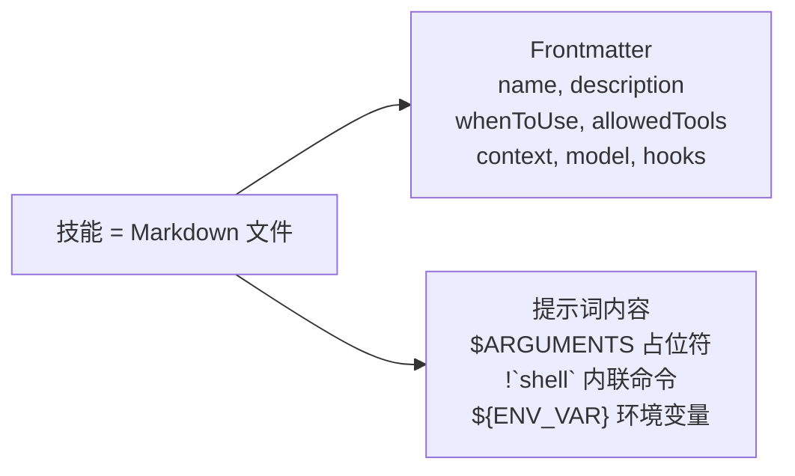
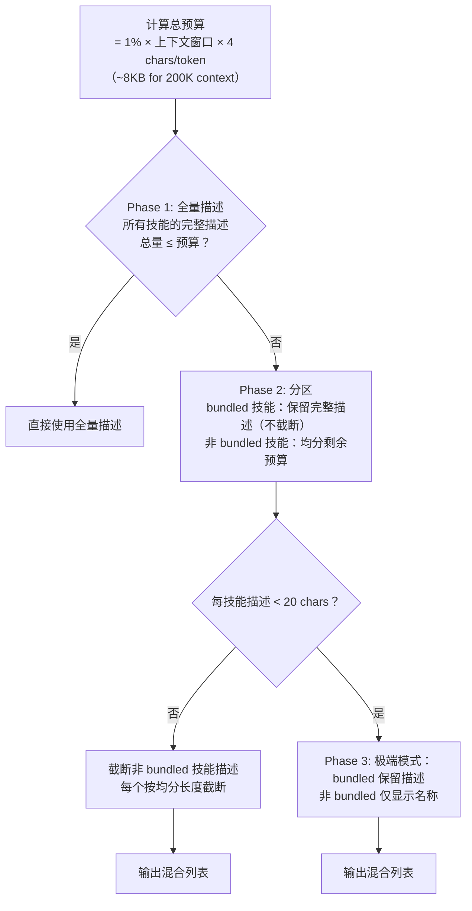
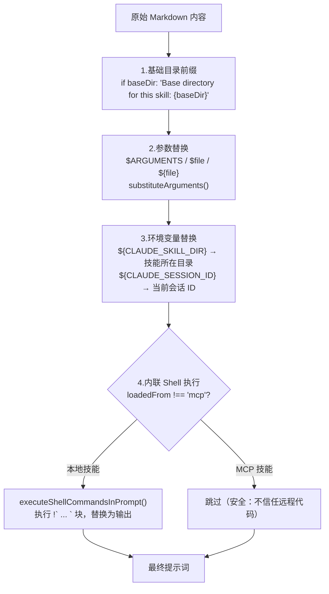
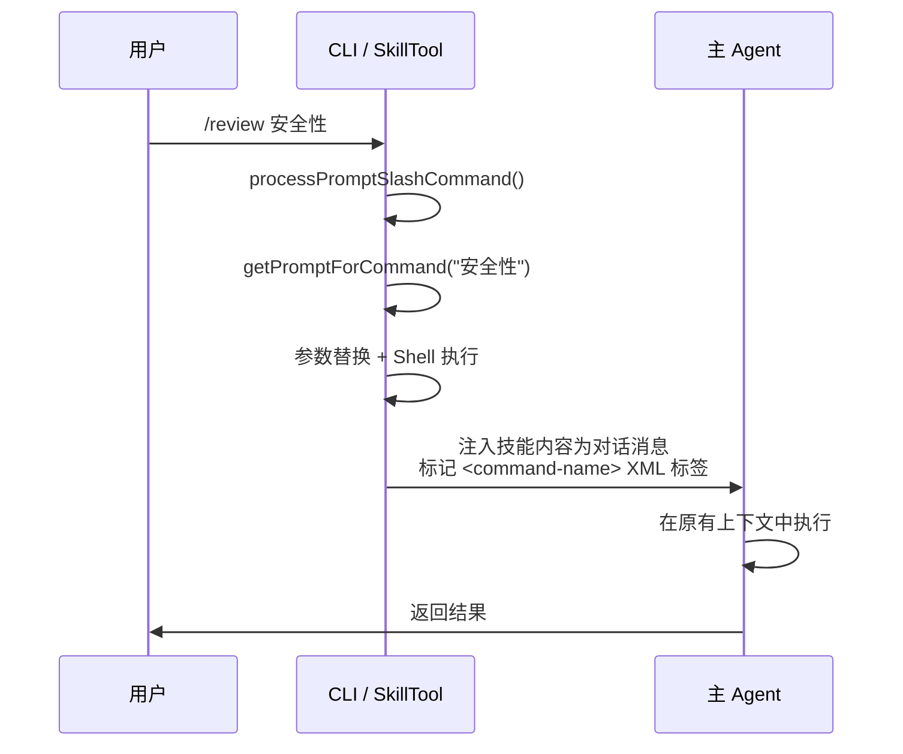
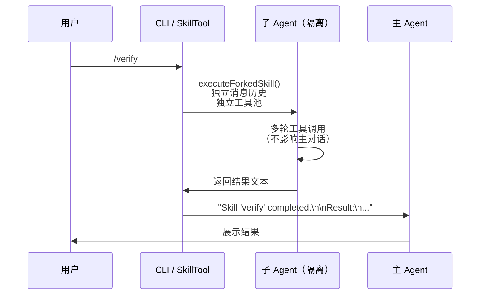
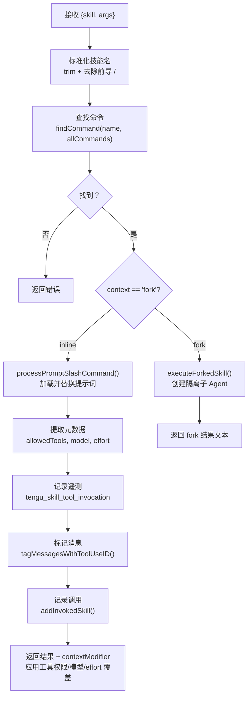

> 技能是 Claude Code 的"AI Shell 脚本" —— 将验证有效的 prompt 模板化，让 Agent 不必每次从头编写相同的流程

# 什么是技能？

想象一个场景：你每次让 Claude Code 帮你提交代码，都要说一大段话：

> "先运行 git status 看看改了什么，再运行 git diff 看具体改动，再看看最近的 commit 风格，然后写一个合适的 commit message，用 heredoc 格式，不要 amend，不要 push..."

这段话说一次还行，每次都说就很烦

技能就是把这段"经过验证的好用提示词"保存成一个文件，下次一个 `/commit` 就搞定

## 用一个真实例子来说明

看 `/simplify` 这个内置技能：

```ts
// src/skills/bundled/simplify.ts:55-69
export function registerSimplifySkill(): void {
  registerBundledSkill({
    name: 'simplify',
    description:
      'Review changed code for reuse, quality, and efficiency, then fix any issues found.',
    userInvocable: true,
    async getPromptForCommand(args) {
      let prompt = SIMPLIFY_PROMPT
      if (args) {
        prompt += `\n\n## Additional Focus\n\n${args}`
      }
      return [{ type: 'text', text: prompt }]
    },
  })
}
```

它做了什么？当你输入 `/simplify` 时，它会把一段精心编写的 50 行提示词注入给模型，指导模型：

1. 先跑 `git diff` 看改了什么
2. 同时启动 3 个子 Agent 分别做：代码复用审查、代码质量审查、效率审查
3. 汇总所有发现，直接修复问题

你不需要每次手写这些指令，一个 `/simplify` 就行了

## 技能的本质

Shell 脚本自动化终端任务，技能自动化 AI 任务。一个技能本质上是：**提示词模板 + 元数据 + 执行上下文**



```txt
┌─────────────────────────────────────────────────┐
│ 技能文件 (Markdown)                               │
│                                                   │
│ ---                          ← Frontmatter 元数据 │
│ name: commit                                      │
│ description: 创建 git commit                      │
│ whenToUse: 用户想提交代码时                        │
│ allowedTools: [Bash, Read]                        │
│ ---                                               │
│                                                   │
│ # Commit 技能                 ← 提示词正文         │
│                                                   │
│ 1. 先运行 git status...                           │
│ 2. 分析改动...                                    │
│ 3. 写 commit message...                           │
│                                                   │
│ $ARGUMENTS              ← 用户参数占位符           │
│ （如 /commit "fix auth bug" 里的 "fix auth bug"） │
└─────────────────────────────────────────────────┘
```

## 两种触发方式

与传统的聊天机器人"命令"不同，Claude Code 的技能有一个关键特性 —— **双重调用模型**：

|调用方式|触发者|示例|
|---|---|---|
|用户手动|用户输入 `/commit` |用户明确需要某个流程|
|模型自动|模型根据 `whenToUse` 判断|用户说"帮我提交代码"，模型识别意图并调用 SkillTool|

- 用户手动调用时，CLI 直接解析 `/command args` 语法
- 模型自动调用时，通过 SkillTool 工具（一个专门的工具定义）来执行

两条路径最终汇合到同一个提示词加载和执行逻辑

```txt
方式一：用户手动输入
─────────────────
用户输入: /commit fix auth bug
    │
    ▼
CLI 解析 → 找到 commit 技能 → 加载提示词 → $ARGUMENTS 替换为 "fix auth bug"
    │
    ▼
把完整提示词作为用户消息发给模型 → 模型按照提示词执行


方式二：模型自动调用
─────────────────
用户输入: "帮我把这些改动提交一下"
    │
    ▼
模型看到技能列表，其中 commit 的 whenToUse 是 "用户想提交代码时"
    │
    ▼
模型判断匹配 → 调用 SkillTool({ skill: "commit", args: "" })
    │
    ▼
同样的流程：加载提示词 → 替换参数 → 执行
```

## PromptCommand 核心类型

技能在代码中表示为 `PromptCommand` 类型（`src/types/command.ts`）：

```ts
type PromptCommand = {
  type: 'prompt'
  name: string                    // 技能名称
  description: string             // 显示描述
  whenToUse?: string              // 模型据此判断何时自动触发
  allowedTools?: string[]         // 允许的工具白名单
  model?: string                  // 模型覆盖
  effort?: EffortValue            // 工作量级别
  context?: 'inline' | 'fork'    // 执行模式
  agent?: string                  // fork 时的 Agent 类型
  source: 'bundled' | 'plugin' | 'skills' | 'mcp'  // 来源
  hooks?: HooksSettings           // 技能级 Hook
  skillRoot?: string              // 技能资源基础目录
  paths?: string[]                // 可见性路径模式
  getPromptForCommand(args, context): Promise<ContentBlockParam[]>  // 内容加载器
}
```

关键文件：`src/skills/loadSkillsDir.ts`、`src/tools/SkillTool/SkillTool.ts`

# 技能来源与优先级

技能从 6 个来源加载，优先级从高到低：

1. 托管技能（managed）：企业策略 policySettings，企业 IT 通过 MDM 策略下发的，路径：`{managed/.claude/skills/}`
2. 项目技能（skills）：工作区级（projectSettings），路径：`.claude/skills/`
3. 用户技能（skills）：用户级（userSettings），路径：`~/.claude/skills/`
4. 插件技能（plugin）：通过插件市场安装的，从已启用插件加载
5. 内置技能（bundled）：
	- 代码里写死的，如 `/simplify, /debug, /verify`
	- `registerBundledSkill()` 启动注册
6. MCP 技能（mcp）：MCP 服务器提供的 prompts，通过 `mcpSkillBuilders` 暴露

高优先级来源的技能在命名冲突时覆盖低优先级

# 加载流程

```txt
扫描技能目录：用户目录/项目目录/.claude/skills/<skill-name>/SKILL.md
        │
        ▼
getSkillDirCommands(cwd)           ← 并行扫描所有技能目录，结果 memoize
        │
        ▼
loadSkillsFromSkillsDir(basePath)  ← 读取目录，筛选 SKILL.md 文件
        │
        ▼
parseFrontmatter(content)          ← 解析 YAML 元数据
parseSkillFrontmatterFields(fm)    ← 提取 name/paths/model/effort/... 字段
        │
        ▼
createSkillCommand(fields)         ← 实例化为 Command 对象，挂入命令系统
        │
        ▼  （用户调用 /<skill-name> 或模型自主选择）
getPromptForCommand(args, ctx)
  ├── substituteArguments()        ← 展开 CLI 参数
  ├── 展开 ${CLAUDE_SKILL_DIR}     ← 内置变量替换
  └── executeShellCommandsInPrompt() ← 执行嵌入 Shell（仅受信任来源）
        │
        ▼
返回给模型的最终 Prompt（含实时系统状态）
```

**技能文件格式要求**：只支持 `skill-name/SKILL.md` 的目录格式 —— 每个技能是一个目录，包含一个 `SKILL.md` 文件。这不是随意的限制：目录格式允许技能附带资源文件（如模板、配置），并通过 `${CLAUDE_SKILL_DIR}` 引用

## 技能发现

`src/skills/loadSkillsDir.ts:638`：

```ts
export const getSkillDirCommands = memoize(
  async (cwd: string): Promise<Command[]> => {
    const userSkillsDir    = join(getClaudeConfigHomeDir(), 'skills')  // ~/.claude/skills
    const managedSkillsDir = join(getManagedFilePath(), '.claude', 'skills')  // 策略管理目录
    const projectSkillsDirs = getProjectDirsUpToHome('skills', cwd)   // 项目目录向上爬取

    // --bare 模式：跳过自动发现，只加载 --add-dir 显式指定的路径
    if (isBareMode()) {
      return additionalDirs.flatMap(dir =>
        loadSkillsFromSkillsDir(join(dir, '.claude', 'skills'), 'projectSettings')
      )
    }

    // 正常模式：并行加载所有来源
    const [managedSkills, userSkills, projectSkillsNested, additionalSkillsNested, legacyCommands] =
      await Promise.all([
        loadSkillsFromSkillsDir(managedSkillsDir, 'policySettings'),    // 策略级技能
        loadSkillsFromSkillsDir(userSkillsDir,    'userSettings'),      // 用户级技能
        Promise.all(projectSkillsDirs.map(dir =>
          loadSkillsFromSkillsDir(dir, 'projectSettings'))),            // 项目级技能（多目录）
        Promise.all(additionalDirs.map(dir =>
          loadSkillsFromSkillsDir(join(dir, '.claude', 'skills'), 'projectSettings'))), // --add-dir
        loadSkillsFromCommandsDir(cwd),                                 // 旧版 /commands/ 目录
      ])

    // 合并 + 去重（realpath，防止软链重复）
    return deduplicateByRealpath([
      ...managedSkills, ...userSkills,
      ...projectSkillsNested.flat(),
      ...additionalSkillsNested.flat(),
      ...legacyCommands,
    ])
  }
)
```

**关键设计点**：

- `memoize` 包裹：同一 `cwd` 只发现一次，结果缓存
- `Promise.all` 并行：所有来源同时读
- 去重通过 `fs.realpath` 取真实路径，防止软链接导致重复加载

**去重：为什么用 realpath 而非 inode**：

去重通过 `realpath()` 解析符号链接实现 —— 相同规范路径的文件视为同一技能。源码注释解释了为什么不用 inode 号：

> 虚拟文件系统、容器文件系统、NFS 可能报告不可靠的 inode 值（如 inode 0），ExFAT 可能丢失精度。`realpath()` 在所有平台上行为一致

这是一个实际环境驱动的决策 —— Claude Code 运行在各种环境中，包括容器和远程文件系统

## 技能解析：Frontmatter 字段

技能文件是 Markdown + YAML frontmatter。以下是所有支持的 frontmatter 字段及详细说明：

```md
---
name: my-skill                    # 显示名称（可选，默认使用目录名）
description: 描述                  # 技能描述（Sonnet 据此判断是否自动触发）
aliases: [ms]                     # 命令别名列表
when_to_use: 自动触发条件描述       # 模型据此判断何时主动调用（影响 SkillTool 触发）
argument-hint: "文件路径"          # 参数提示（显示在帮助和 Tab 补全中）
arguments: [file, mode]           # 命名参数列表（映射到 $file, $mode）
allowed-tools: [Bash, Edit, Read] # 允许的工具白名单（限制技能可使用的工具）
model: claude-sonnet              # 模型覆盖（"inherit" = 继承父级，不覆盖）
effort: quick                     # 工作量：quick / standard / 整数分钟
context: fork                     # 执行上下文：inline（默认）或 fork
agent: explorer                   # fork 时使用的 Agent 类型
version: "1.0"                    # 语义版本号
shell: bash                       # 内联 Shell 块使用的 Shell 类型
user-invocable: true              # false 则隐藏，用户不可通过 /name 直接调用
disable-model-invocation: false   # true 则只允许用户手动 /skill 调用，模型不可自动触发
paths:                            # 可见性路径模式（gitignore 风格）
  - "src/components/**"           # 仅在匹配路径下工作时显示此技能
hooks:                            # 技能级 Hook 定义
  PreToolUse:
    - matcher: "Bash(*)"
      hooks:
        - type: command
          command: "echo checking"
---

技能提示词内容...
可以引用 $ARGUMENTS 占位符
```

`parseSkillFrontmatterFields()` 统一处理所有字段解析（`src/skills/loadSkillsDir.ts`）：

- **model**：`"inherit"` 被解析为 undefined，意味着使用当前会话的模型。其他值（如 `"claude-sonnet"`）作为模型覆盖
- **effort**：影响模型的思考深度，接受三种格式：
	- `"quick"`（快速任务）
	- `"standard"`（标准任务）
	- 整数（自定义分钟数）
- **paths**：gitignore 风格的路径模式
	- `parseSkillPaths()` 会去除 `/**` 后缀并过滤掉匹配所有文件的模式（如 `*`）
	- 这允许技能仅在特定代码区域激活 —— 例如一个 React 组件技能只在 `src/components/` 下可见
- **hooks 解析**：通过 Zod schema（`HooksSchema().safeParse`）校验
	- 无效的 hooks 定义**仅记录警告但不致命** —— 一个格式错误的 hook 不应该阻止整个技能加载
- **arguments**：命名参数通过 `parseArgumentNames()` 提取。在提示词替换时，`$file` 和 `${file}` 都映射到 `arguments[0]` 的值

## 技能实例化：`createSkillCommand()`

`src/skills/loadSkillsDir.ts:270` 精简节选：

```ts
export function createSkillCommand({
  skillName, markdownContent, allowedTools,
  loadedFrom, baseDir, paths, shell, ...rest
}: SkillCommandOptions): Command {
  return {
    type: 'prompt',
    name: skillName,
    paths,   // 条件技能触发路径
    isHidden: !userInvocable,
    // ...

    // 核心执行逻辑：getPromptForCommand 在模型调用技能时触发
    async getPromptForCommand(args, toolUseContext) {
      let finalContent = markdownContent  // 原始 Markdown 内容

      // 1. 展开 CLI 参数占位符
      finalContent = substituteArguments(finalContent, args, true, argumentNames)

      // 2. 展开内置变量（skill 目录、session ID）
      if (baseDir) {
        const skillDir = baseDir.replace(/\\/g, '/')  // Windows 路径标准化
        finalContent = finalContent.replace(/\${CLAUDE_SKILL_DIR}/g, skillDir)
      }
      finalContent = finalContent.replace(/\${CLAUDE_SESSION_ID}/g, getSessionId())

      // 3. 执行 prompt 内嵌 Shell 命令（只对受信任来源执行，MCP 来源跳过）
      if (loadedFrom !== 'mcp') {
        finalContent = await executeShellCommandsInPrompt(
          finalContent, toolUseContext, `/${skillName}`, shell
        )
      }

      return [{ type: 'text', text: finalContent }]
    },
  }
}
```

## 内嵌 Shell 执行：`executeShellCommandsInPrompt()`

这是 Skills 系统最精妙的功能：Markdown 内容里可以嵌入 Shell 命令，这些命令在技能被调用前先在宿主机执行，输出结果替换回 Markdown 正文

**语法示例**（在 `.claude/skills/my-skill/SKILL.md` 里）：

```md
---
name: git-status-helper
description: 查看当前 Git 状态并提供建议
---

当前分支信息：
!`git log --oneline -5`

未提交的变更：
!`git status --short`

请根据以上信息帮我分析当前代码状态。
```

`src/utils/promptShellExecution.ts:69`：

```ts
export async function executeShellCommandsInPrompt(
  text: string,
  context: ToolUseContext,
  slashCommandName: string,
  shell?: FrontmatterShell,
): Promise<string> {
  let result = text

  // 选择执行工具：默认 BashTool，frontmatter 可指定 PowerShell
  const shellTool = shell === 'powershell' && isPowerShellToolEnabled()
    ? getPowerShellTool()
    : BashTool

  // 扫描两种语法：!`command`（内联）和 ```!\ncommand\n```（代码块）
  const blockMatches  = text.matchAll(BLOCK_PATTERN)
  const inlineMatches = text.includes('!`') ? text.matchAll(INLINE_PATTERN) : []

  await Promise.all(
    [...blockMatches, ...inlineMatches].map(async match => {
      const command = match[1]?.trim()
      if (!command) return

      // 1. 权限检查（走同一套 ToolPermission 流程）
      const permissionResult = await hasPermissionsToUseTool(
        shellTool, { command }, context,
        createAssistantMessage({ content: [] }), '',
      )
      if (permissionResult.behavior !== 'allow') {
        throw new MalformedCommandError(`Permission denied: ${permissionResult.message}`)
      }

      // 2. 执行 Shell 命令
      const { data } = await shellTool.call({ command }, context)

      // 3. 提取输出并替换原始 pattern
      const output = typeof toolResultBlock.content === 'string'
        ? toolResultBlock.content
        : formatBashOutput(data.stdout, data.stderr)

      // 注意：用函数形式替换，防止 $& 等特殊替换符号被 PowerShell 输出污染
      result = result.replace(match[0], () => output)
    })
  )

  return result
}
```

**安全切断**：`loadedFrom !== 'mcp'` 这个判断极为关键 —— 来自 MCP Server 的技能不会执行内嵌 Shell，防止恶意远程服务器通过 MCP 注入 RCE（远程代码执行）攻击。同时，所有命令执行前都走 `hasPermissionsToUseTool`，遵从同一套权限体系

# 懒加载与 Token 预算

## 懒加载：渐进式披露

技能内容**不在启动时加载** —— 只有 frontmatter（name, description, whenToUse）被预加载。完整的 Markdown 内容在用户实际调用或模型触发时才读取

```ts
export function estimateSkillFrontmatterTokens(skill: Command): number {
  const frontmatterText = [skill.name, skill.description, skill.whenToUse]
    .filter(Boolean)
    .join(' ')
  return roughTokenCountEstimation(frontmatterText)
}
```

**为什么懒加载？** 系统可能注册几十个技能。如果全部加载到系统提示词中：

- 挤占上下文空间（一个技能可能有几百行提示词）
- 大部分技能在当前会话中不会被使用
- 加载时间增加，影响首次响应速度

通过只加载 frontmatter 来展示可用技能列表，将内容加载推迟到调用时，实现了"展示成本低、执行成本按需"

## Token 预算分配算法

技能列表在系统提示词中需要占据空间，但空间有限。`formatCommandsWithinBudget()`（`src/tools/SkillTool/prompt.ts`）实现了一个三阶段预算分配算法：



1. 尝试所有技能使用完整描述。如果总量在预算内，直接完成
2. 将技能分为 bundled（内置）和 rest（非内置）两组
	- Bundled 技能始终保留完整描述 —— 它们是核心功能，截断会隐藏基本能力
	- 计算 bundled 占用后的剩余预算，在非 bundled 技能间均分
3. 极端情况。如果均分后每个技能不足 20 个字符（`MIN_DESC_LENGTH`），非 bundled 技能降级为仅显示名称。此时仍然可以看到技能存在，只是没有描述

**为什么保护 bundled 技能？** Bundled 技能代表 Claude Code 的核心能力（如 `/commit`、`/review`、`/debug`）。用户期望始终能看到这些技能及其功能说明。即使安装了大量自定义技能导致预算压力，核心功能的可发现性也不能牺牲

每个技能描述还有一个硬上限：`MAX_LISTING_DESC_CHARS = 250` 字符，即使在预算充裕时也不允许单个技能占据过多空间

# 提示词替换管道

技能内容在执行时经过多层替换，由 `getPromptForCommand()` 驱动：



## 1. 基础目录前缀

如果技能有关联目录（`skillRoot`），在提示词开头插入 `"Base directory for this skill: {baseDir}"`。这让技能的提示词可以引用相对路径资源

## 2. 参数替换

`substituteArguments()` 处理两种参数格式：

- `$ARGUMENTS`：替换为用户输入的全部参数字符串
- `$file` / `${file}`：替换为对应的命名参数（从 frontmatter 的 `arguments` 字段映射）

例如，技能定义 `arguments: [file, format]`，用户输入 `/skill main.ts json`，则 `$file` → `main.ts`，`$format` → `json`

## 3. 环境变量替换

- `${CLAUDE_SKILL_DIR}`：替换为技能文件所在的目录路径。在 Windows 上，反斜杠自动转为正斜杠以保持路径一致性
- `${CLAUDE_SESSION_ID}`：替换为当前会话 ID，允许技能按会话隔离状态

## 4. 内联 Shell 执行

技能 Markdown 中可以嵌入 `` !`command` `` 格式的 Shell 命令。执行时命令被运行，输出替换回原位。这允许技能动态获取环境信息：

```md
当前分支：!`git branch --show-current`
最近提交：!`git log --oneline -5`
```

Shell 类型可通过 frontmatter 的 `shell` 字段指定（bash/zsh/fish）

## MCP 安全隔离

MCP 技能来自远程不受信任的服务端，因此有两项安全限制：

```ts
// Security: MCP skills are remote and untrusted — never execute inline
// shell commands (!`…` / ```! … ```) from their markdown body.
if (loadedFrom !== 'mcp') {
  finalContent = await executeShellCommandsInPrompt(finalContent, ...)
}
```

1. **禁用内联 Shell 执行**：远程提示词中的  `!rm -rf /` 不会被执行
2. **不替换 `${CLAUDE_SKILL_DIR}`**：对远程技能无意义，且暴露本地路径是信息泄露

# 技能执行：Inline VS. Fork

技能有两种执行上下文，由 frontmatter 的 `context` 字段决定：

## Inline 模式（默认）



提示词作为消息注入当前对话。模型在原有上下文中继续执行 —— 可以看到之前的对话历史、使用所有可用工具

- **优势**：共享对话上下文，可以引用之前的讨论；无额外开销
- **劣势**：技能提示词占据主对话上下文空间；工具调用污染主对话历史
- **适用场景**：快速行为修改（如 `simplify` —— 审查刚写的代码）、需要引用对话上下文的任务

## Fork 模式



创建独立的子 Agent，有自己的消息历史和工具池。完成后结果返回父对话

- **优势**：不污染主对话上下文；可限制工具集（安全隔离）；可使用不同的模型
- **劣势**：不能引用主对话历史中的内容；有创建子 Agent 的额外开销
- **适用场景**：需要大量工具调用的复杂任务（如 `verify` —— 运行完整测试套件）、需要工具限制的安全敏感任务

## 对比总结

|维度|Inline|Fork|
|---|---|---|
|对话历史|共享主对话|独立|
|工具池|主 Agent 全部工具| `allowedTools` 限制|
|上下文影响|占据主上下文空间|不影响主上下文|
|模型|使用当前模型（可覆盖）|可指定不同模型|
|结果形式|直接在对话中输出|汇总为一段文本返回|

## 何时选择 Fork？

- 任务需要大量工具调用（会污染主对话上下文）
- 需要限制可用工具（安全隔离 —— 如 review 技能不应该能写文件）
- 需要使用不同的模型（如用 Sonnet 做快速检查，用 Opus 做深度分析）
- 需要独立的失败隔离（fork 失败不影响主对话流）

## 模型覆盖解析

当技能指定 `model` 字段时，`resolveSkillModelOverride()` 处理解析：

- `"inherit"` → undefined（使用父级模型，不覆盖）
- 具体模型别名（如 `"claude-sonnet"`）→ 解析为实际模型 ID
- 如果主会话有模型后缀（如 `[1m]`），覆盖时会保留该后缀

## AllowedTools 在 Fork 模式下的安全意义

当技能指定 `allowed-tools: [Bash, Read, Grep, Glob]` 时，fork 出的子 Agent **只能使用这些工具**。这是安全隔离的关键：

- 一个代码审查技能不需要写文件的能力 —— 限制为只读工具
- 一个测试运行技能不需要网络访问 —— 限制为 Bash + Read

工具限制通过 `contextModifier` 在返回结果时应用，修改上下文中的 `alwaysAllowRules`

# 技能的权限模型

## SAFE_SKILL_PROPERTIES 白名单

SkillTool 在执行技能前需要检查权限。一个关键优化是：**只包含"安全属性"的技能自动允许，无需用户确认**

"安全属性"由 `SAFE_SKILL_PROPERTIES` 白名单定义（`src/tools/SkillTool/SkillTool.ts`）：

```ts
const SAFE_SKILL_PROPERTIES = new Set([
  // PromptCommand 属性
  'type', 'progressMessage', 'contentLength', 'argNames', 'model', 'effort',
  'source', 'pluginInfo', 'disableNonInteractive', 'skillRoot', 'context',
  'agent', 'getPromptForCommand', 'frontmatterKeys',
  // CommandBase 属性
  'name', 'description', 'hasUserSpecifiedDescription', 'isEnabled',
  'isHidden', 'aliases', 'isMcp', 'argumentHint', 'whenToUse', 'paths',
  'version', 'disableModelInvocation', 'userInvocable', 'loadedFrom',
  'immediate'
])
```

`skillHasOnlySafeProperties()` 遍历技能对象的所有键，检查每个键是否在白名单中。undefined/null/空值视为安全

**为什么是白名单而非黑名单？** 前向兼容安全。如果未来 `PromptCommand` 类型增加了新属性（如 `networkAccess`），白名单模式下它**默认需要权限审批**，直到被显式加入白名单。黑名单模式则相反 —— 新属性默认被允许，必须被显式加入黑名单才会触发审批。在安全敏感的上下文中，"默认拒绝"比"默认允许"更安全

## 不同来源的信任级别

|来源|信任级别|说明|
|---|---|---|
|managed（企业策略）|最高|企业管理员审核过|
|bundled（内置）|高|Claude Code 团队维护|
|project/user skills|中|用户自己创建，安全属性自动允许，其他需确认|
|plugin|中低|第三方代码，需要启用插件的显式同意|
|MCP|最低|远程不受信任，禁用 Shell 执行|

# 压缩后的技能保留

## 问题

当对话过长触发 autocompact（上下文压缩）时，之前注入的技能提示词会被**压缩摘要覆盖**。模型失去对技能指令的访问，导致行为在压缩前后不一致 —— 压缩前按技能指令行事，压缩后"忘记"了技能

## 解决方案

`addInvokedSkill()` 在每次技能调用时记录完整信息到全局状态：

```ts
addInvokedSkill(name, path, content, agentId)
// 记录：名称、路径、完整内容、时间戳、所属 Agent ID
```

压缩后，`createSkillAttachmentIfNeeded()` 从全局状态重建技能内容作为 attachment 重新注入

## 预算管理

```ts
POST_COMPACT_SKILLS_TOKEN_BUDGET = 25,000  // 总预算
POST_COMPACT_MAX_TOKENS_PER_SKILL = 5,000  // 单技能上限
```

- 按**最近调用优先**排序 —— 最近使用的技能最可能仍然相关
- 超出单技能上限时，**保留头部截断尾部** —— 因为技能的设置指令和使用说明通常在开头
- 超出总预算时，最不活跃的技能被丢弃

## Agent 作用域隔离

记录的技能按 `agentId` 隔离 —— 子 Agent 调用的技能不会泄漏到父 Agent 的压缩恢复中，反之亦然。`clearInvokedSkillsForAgent(agentId)` 在 fork Agent 完成时清理其技能记录

**为什么这个机制重要？** 没有它，一个长时间的编码会话（跨越多次压缩）会逐渐"忘记"技能上下文。用户在第 50 轮使用 `/commit` 时的行为应该与第 5 轮一致 —— 技能保留机制确保了这种一致性

# 内置技能详解

## 注册机制

内置技能通过 `registerBundledSkill()` 在启动时注册（`src/skills/bundledSkills.ts`）：

```ts
registerBundledSkill({
  name: 'remember',
  description: 'Review auto-memory entries...',
  whenToUse: 'Use when...',
  userInvocable: true,
  isEnabled: () => isAutoMemoryEnabled(),
  async getPromptForCommand(args) {
    return [{ type: 'text', text: SKILL_PROMPT }]
  }
})
```

与文件系统技能不同，内置技能的内容编译在二进制中，不需要运行时文件读取

## 始终注册的技能

| 技能             | 用途                    | 执行上下文  |
| -------------- | --------------------- | ------ |
| `updateConfig` | 修改 `settings.json` 配置 | inline |
| `keybindings`  | 快捷键参考                 | inline |
| `verify`       | 验证工作流                 | fork   |
| `debug`        | 调试工具                  | inline |
| `simplify`     | 代码简化审查                | inline |
| `batch`        | 批量操作                  | fork   |
| `stuck`        | 卡住时的帮助                | inline |
| `remember`     | 显式保存记忆                | inline |
| `skillify`     | Markdown 脚本转技能        | inline |

## Feature-gated 技能

|技能|Feature Flag|用途|
|---|---|---|
| `dream` |KAIROS / KAIROS_DREAM|每日日志蒸馏|
| `hunter` |REVIEW_ARTIFACT|制品审查|
| `/loop` |AGENT_TRIGGERS|类 Cron 的 Agent 触发|
| `claudeApi` |BUILDING_CLAUDE_APPS|Claude API 辅助|
| `claudeInChrome` |自动检测|Chrome 集成|

## 安全的文件提取

部分内置技能需要在运行时提取资源文件（如提示词模板）到磁盘。这通过 `safeWriteFile()` 实现，使用了多重安全措施：

- **`O_NOFOLLOW | O_EXCL` 标志**：防止符号链接攻击。攻击者可能预先在目标路径创建指向敏感文件的符号链接
- **每进程 nonce 目录**：使用随机命名的临时目录，防止路径预测
- **owner-only 权限**（0o700/0o600）：只有当前用户可以读写

**懒提取**：`extractionPromise` 被 memoize 化，多个并发调用等待同一个提取完成，而不是各自竞争

# MCP 技能集成

MCP（Model Context Protocol）服务端可以向 Claude Code 暴露技能，与本地技能无缝融合

## 加载路径

MCP 技能通过 `mcpSkillBuilders` 注册表构建。当 SkillTool 获取所有命令时，同时加载本地和 MCP 技能，按名称去重

## 安全模型

MCP 技能被视为**不受信任的远程代码**，施加了最严格的安全限制：

|限制项|原因|
|---|---|
|禁用内联 Shell 执行|远程提示词中的 shell 命令可能是恶意的|
|不替换 `${CLAUDE_SKILL_DIR}` |暴露本地路径是信息泄露|
| `disableModelInvocation: true` 可选|服务端可以要求技能只能手动触发|
|没有文件系统资源|MCP 技能没有 `skillRoot` 目录|

尽管受限，MCP 技能仍然可以使用参数替换（`$ARGUMENTS`）和所有非 Shell 的功能，且在 UI 和模型视角中与本地技能无差别

# 技能级 Hook

技能可以在 frontmatter 中定义自己的 Hook，在技能执行期间生效：

```ts
hooks:
  PreToolUse:
    - matcher: "Bash(*)"
      hooks:
        - type: command
          command: "echo '{\"hookSpecificOutput\": {\"hookEventName\": \"PreToolUse\", \"updatedInput\": {\"command\": \"$ORIGINAL_CMD --dry-run\"}}}'"
```

## 层级叠加

```txt
全局 Hook（settings.json）── 始终生效
  └── 技能级 Hook（技能 frontmatter）── 仅在该技能执行时生效
```

技能级 Hook 不覆盖全局 Hook，而是**叠加**。两者同时生效，全局 Hook 先执行

## Hook 注册时机

技能的 Hook 通过 `registerSkillHooks()` 在技能被调用时注册 —— 不是启动时。这与懒加载原则一致：只在需要时激活

## 校验与容错

Hook 定义通过 Zod schema 校验。如果定义格式错误：

- 记录警告日志
- **不阻止技能加载** —— 一个无效的 Hook 不应该让整个技能无法使用
- 无效的 Hook 被忽略，有效部分正常生效

## 实际应用示例

**部署技能的安全网**：

```md
hooks:
  PreToolUse:
    - matcher: "Bash(*)"
      hooks:
        - type: command
          command: "validate-deploy-command.sh"
```

**日志收集技能**：

```md
hooks:
  PostToolUse:
    - matcher: "*"
      hooks:
        - type: command
          command: "log-tool-usage.sh $TOOL_NAME"
```

# 自定义技能实战

## 示例 1：代码审查技能（Fork 模式）

```md
---
name: review
description: 审查当前分支的所有改动，检查代码质量和潜在问题
when_to_use: 当用户要求审查代码、检查改动、或在提交前做 review 时
argument-hint: 可选的关注点（如"安全性"、"性能"）
allowed-tools: [Bash, Read, Grep, Glob]
context: fork
---

审查当前分支相对于 main 的所有改动。

关注点：$ARGUMENTS

步骤：
1. 运行 `git diff main...HEAD` 查看所有改动
2. 逐文件分析代码质量
3. 检查：安全漏洞、错误处理、边界情况、命名规范
4. 输出结构化的审查报告，包括问题严重级别
```

**选择 fork 的原因**：审查需要大量 `git diff`、`Read`、`Grep` 调用，这些会污染主对话上下文。fork 模式让审查在隔离环境中完成，只返回最终报告

`allowed-tools` 限制为只读工具 —— 审查不应该修改代码

## 示例 2：代码风格检查（Inline 模式）

```md
---
name: lint-check
description: 检查最近修改的文件是否符合项目代码风格
when_to_use: 当用户修改了代码后想快速检查风格一致性时
---

检查我最近修改的文件是否符合项目的代码风格约定。

步骤：
1. 运行 `git diff --name-only` 获取改动文件列表
2. 对每个文件运行项目配置的 linter
3. 汇总结果，如果有问题直接修复
```

**选择 inline 的原因**：这个技能可能需要修复代码（Edit 工具），需要完整的工具访问权限。它的工具调用量不大，不会严重污染上下文

## 示例 3：快速检查（Fork + 不同模型）

```md
---
name: quick-check
description: 用 Sonnet 快速检查代码的明显问题
context: fork
model: claude-sonnet
effort: quick
allowed-tools: [Read, Grep, Glob]
---

快速扫描以下文件的明显问题：$ARGUMENTS

重点关注：
- 未处理的异常
- 硬编码的密钥或密码
- 明显的逻辑错误
```

**选择 fork + sonnet 的原因**：这是一个快速检查，不需要深度思考。使用 Sonnet 更快且更便宜。fork 模式确保隔离。`effort: quick` 进一步降低思考深度

## whenToUse 写作技巧

`whenToUse` 字段决定了模型何时自动触发技能。好的 `whenToUse` 应该：

- **描述用户意图，而非用户的措辞**："当用户需要审查代码质量时" 好于 "当用户说 review 时"
- **包含否定条件**："当用户要求审查代码时，但不用于 PR 描述生成" 帮助模型区分相似场景
- **具体而非笼统**："当用户修改了多个文件并想在提交前检查" 好于 "当用户需要帮助时"

# SkillTool 的完整执行流程

当模型决定调用一个技能时，SkillTool 的 `call()` 方法执行以下步骤：



`contextModifier` 是返回值中的关键部分 —— 它是一个函数，在后续回合中修改执行上下文：

- 如果技能指定了 `allowedTools`，追加到 `alwaysAllowRules`
- 如果技能指定了 `model`，覆盖 `mainLoopModel`
- 如果技能指定了 `effort`，覆盖 `effortValue`

# 设计亮点总结

- **发现与执行分离**：Frontmatter 用于浏览和发现（低成本），完整内容用于执行（按需加载）。这是管理大型工具集的通用模式 —— 渐进式披露
- **白名单权限是前向兼容安全**：新增属性默认需要权限审批。这比黑名单更安全 —— 遗漏的黑名单条目是安全漏洞，遗漏的白名单条目只是多一次用户确认
- **Markdown + Frontmatter 是正确的格式选择**：人类可读、版本控制友好、Git diff 清晰、不需要特殊工具。比 JSON/YAML 配置文件更适合包含大量提示词文本的场景
- **双重调用模型扩展了技能的适用范围**：纯手动触发（传统 slash command）限制了使用场景。模型自动触发让技能成为 Agent 行为的一部分 —— 用户不需要记住命令名，只需要表达意图
- **压缩后恢复确保长会话一致性**：这是一个容易被忽略的细节 —— 没有它，长对话中技能会"衰减"。按时间优先的预算分配是合理的启发式：最近使用的技能最可能仍然相关
- **fork 模式是隔离和安全的关键**：它不只是"在另一个线程运行" —— 它是完整的权限隔离（限制工具）、上下文隔离（不污染主对话）、和模型隔离（可用不同模型）
- **MCP 技能的信任边界清晰**：远程代码默认不受信任，安全限制是显式的。这比"默认信任、出了问题再修"的模式更健壮
