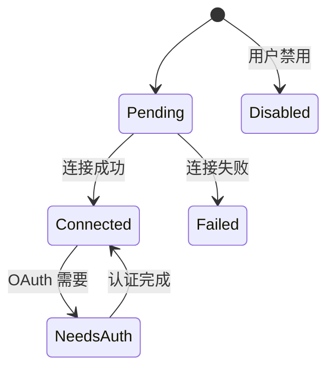

# 导读

MCP（Model Context Protocol）是 Anthropic 主导的开放标准，让 AI 模型能统一接入外部工具和数据源。Claude Code 对 MCP 做了深度集成，支持四种传输协议、完整的认证体系和并发安全管理

主要源文件：

- `src/services/mcp/client.ts`：MCP 客户端核心
- `src/services/mcp/auth.ts`：OAuth 认证与 Step-up 检测
- `src/services/mcp/mcpStringUtils.ts`：工具命名规则
- `src/utils/mcpWebSocketTransport.ts`：WebSocket 传输层

# MCP 工具集成

MCP（Model Context Protocol）工具通过桥接层无缝集成到 Claude Code 的工具系统中

## 桥接工具

|Claude Code 工具|MCP 功能|
|---|---|
|MCPTool|调用单个 MCP 工具|
|ListMcpResourcesTool|列出 MCP 资源|
|ReadMcpResourceTool|读取 MCP 资源内容|
|createMcpAuthTool()|OAuth 认证处理|

## 7 种传输机制

```ts
type McpTransport =
  | 'stdio'          // 标准输入/输出（子进程 MCP 服务端）
  | 'sse'            // Server-Sent Events（HTTP 流式）
  | 'sse-ide'        // SSE 变体（IDE 扩展）
  | 'http'           // HTTP 传输（StreamableHTTPClientTransport）
  | 'ws'             // WebSocket（双向实时）
  | 'sdk'            // SDK 原生传输（进程内，SdkControlTransport）
  | 'claudeai-proxy' // Claude.ai 代理服务端
```

## 连接状态机



客户端实例被 memoized，避免重复初始化。HTTP 404 + JSON-RPC-32001 检测会话过期

## OAuth 支持

MCP 集成支持三阶段 OAuth：

1. **标准 OAuth 2.0 + PKCE**：自动 Token 轮换，30 秒超时
2. **跨应用访问（XAA）via OIDC**：企业 IdP 集成，一次登录多个 MCP 服务端
3. **Token 验证**：主动刷新接近过期的 Token，macOS Keychain 缓存

## 配置与作用域

```json
{
  "mcpServers": {
    "my-server": {
      "command": "node",
      "args": ["my-mcp-server.js"]
    },
    "remote-server": {
      "url": "https://api.example.com/mcp"
    }
  }
}
```

MCP 服务端配置支持 7 种作用域：local / user / project / dynamic / enterprise / claudeai / managed

MCP 工具在 `assembleToolPool()` 阶段与内置工具合并，经过去重处理后统一注册

> [!question] 设计决策：为什么 MCP 适合 Agent 生态？
> 
> MCP 的核心设计思想是**协议而非 SDK** —— 任何语言、任何进程都可以实现 MCP 服务端，只要遵循 JSON-RPC 协议
> 
> 这与 Claude Code 的工具系统形成了天然互补：内置工具是"深度集成"（直接访问进程内状态），MCP 工具是"广度扩展"（连接外部能力）
> 
> 7 种传输机制的存在反映了现实世界的多样性：
> 
> - 本地工具用 stdio（零网络开销）
> - 远程服务用 HTTP/WebSocket（支持认证和断线重连）
> - IDE 插件用 SSE-IDE（适配 VS Code 的进程模型）
> 
> 配置的 7 层作用域（从本地到企业）则确保了不同组织规模下的管理需求都能被满足

# 工具池集成

MCP 工具加载后，通过 `assembleToolPool()` 与内建工具合并到统一的工具池：

```typescript
// src/tools.ts（伪代码）
export function assembleToolPool(
  permissionContext: ToolPermissionContext,
  mcpTools: Tool[],
): Tool[] {
  const builtinTools = getTools(permissionContext)
  return [
    ...builtinTools,                           // 内建工具优先
    ...mcpTools.filter(isIncludedMcpTool),     // MCP 工具白名单过滤
  ]
    .sort((a, b) => a.name.localeCompare(b.name))  // 排序
    .filter(deduplicateByName())                    // 去重（内建优先）
}
```

对模型而言，无论工具来自内建还是 MCP，都只是 `Tool` 接口的一个实例，Schema 完全一致

## 工具命名规则

所有 MCP 工具在被统一进工具池时，名称通过 `buildMcpToolName()` 规范化：

```typescript
// src/services/mcp/mcpStringUtils.ts
export function buildMcpToolName(serverName: string, toolName: string): string {
  return `mcp__${serverName}__${toolName}`
  // 示例：
  //   mcp__filesystem__read_file
  //   mcp__puppeteer__screenshot
  //   mcp__ide__getDiagnostics
}
```

这个一致的命名格式让工具池中的 MCP 工具和内建工具保持统一 schema，模型无需区分来源

## 描述长度限制

```typescript
// src/services/mcp/client.ts:218
// 注释原文：OpenAPI-generated MCP servers have been observed dumping 15-60KB
// of endpoint docs into tool.description; this caps the p95 tail without losing the intent.
// OpenAPI 生成的 MCP 服务器被观察到向 tool.description 倾倒了 15-60KB 的端点文档;
// 这在不丢失意图的情况下限制了 P95 尾部。
const MAX_MCP_DESCRIPTION_LENGTH = 2048
```

这个常量作用于工具列表转换阶段：所有超过 2048 字符的工具描述会被强制截断，防止（来自 OpenAPI 衍生 MCP 服务的）超长文档塞满模型的 Context Window

# 连接 MCP 服务器

## 连接管理：`connectToServer()`

`src/services/mcp/client.ts:595`：

```typescript
// 用 memoize 包装：同一 server 配置只建一次连接
export const connectToServer = memoize(
  async (
    name: string,
    serverRef: ScopedMcpServerConfig,
    serverStats?: { totalServers: number; stdioCount: number; ... },
  ): Promise<MCPServerConnection> => {
    let transport

    // 根据 serverRef.type 选择传输层
    if (serverRef.type === 'sse') {
      const authProvider = new ClaudeAuthProvider(name, serverRef)
      transport = new SSEClientTransport(serverRef.url, {
        authProvider,
        fetch: wrapFetchWithTimeout(
          wrapFetchWithStepUpDetection(createFetchWithInit(), authProvider)
        ),
      })
    } else if (serverRef.type === 'ws' || serverRef.type === 'ws-ide') {
      transport = new WebSocketTransport(serverRef.url)
    } else if (serverRef.type === 'http' || serverRef.type === 'streamable-http') {
      transport = new StreamableHTTPClientTransport(serverRef.url, {
        fetch: wrapFetchWithTimeout(createClaudeAiProxyFetch(baseFetch)),
      })
    } else {  // 默认：stdio
      transport = new StdioClientTransport({
        command: serverRef.command,
        args: serverRef.args,
        env: serverRef.env,
      })
    }

    const client = new Client({ name: 'claude-code', version: ... })
    await client.connect(transport)
    return { client, transport, ... }
  },
  getServerCacheKey  // 缓存键 = name + JSON(serverRef)
)
```

四种传输协议对比：

| 类型 | 适用场景 | 底层传输 |
|------|----------|----------|
| `stdio` | 本地进程（最常用） | `StdioClientTransport` |
| `sse` / `sse-ide` | 远程 HTTP 长连接 | `SSEClientTransport` |
| `ws` / `ws-ide` | 长久 WebSocket 通道（IDE 集成）| `WebSocketTransport` |
| `http` / `streamable-http` | HTTP + claude.ai 代理 | `StreamableHTTPClientTransport` |

## 超时控制：`wrapFetchWithTimeout()`

`src/services/mcp/client.ts:492`：

```typescript
export function wrapFetchWithTimeout(baseFetch: FetchLike): FetchLike {
  return async (url: string | URL, init?: RequestInit) => {
    const method = (init?.method ?? 'GET').toUpperCase()

    // GET 请求不加超时 —— SSE 是长连接 GET，不能被超时切断
    if (method === 'GET') return baseFetch(url, init)

    // 用 setTimeout 而非 AbortSignal.timeout()
    // 原因：AbortSignal.timeout() 在 Bun 中内存泄漏（每请求约 2.4KB 在 GC 前一直残留）
    const controller = new AbortController()
    const timer = setTimeout(
      c => c.abort(new DOMException('The operation timed out.', 'TimeoutError')),
      MCP_REQUEST_TIMEOUT_MS,
      controller,
    )
    timer.unref?.()  // 不阻止进程退出

    try {
      const response = await baseFetch(url, { ...init, signal: controller.signal })
      clearTimeout(timer)
      return response
    } catch (error) {
      clearTimeout(timer)
      throw error
    }
  }
}
```

**工程细节**：注释直接解释了为什么不用更简洁的 `AbortSignal.timeout()` —— 这是针对 Bun 运行时的已知内存泄漏问题的针对性规避

## 并发连接控制

```typescript
// src/services/mcp/client.ts:552
export function getMcpServerConnectionBatchSize(): number {
  // 可通过环境变量覆盖，默认 3 个并发（本地）
  return parseInt(process.env.MCP_SERVER_CONNECTION_BATCH_SIZE || '', 10) || 3
}

function getRemoteMcpServerConnectionBatchSize(): number {
  // 远端连接默认 20 个并发（网络 IO，并发价值更高）
  return parseInt(process.env.MCP_REMOTE_SERVER_CONNECTION_BATCH_SIZE || '', 10) || 20
}
```

通过 `pMap(servers, connectToServer, { concurrency: batchSize })` 控制连接并发，防止启动时大量 MCP 并发导致卡死

## 认证缓存：防止"认证雪崩"

**问题背景**：如果一个 Token 失效，100 个并发工具子调用会同时发现 401/403，然后全部发起 Token 刷新请求 —— 形成"认证雪崩"

**解决方案**：用本地文件缓存是否认证失败（`src/services/mcp/client.ts:259`）：

```typescript
type McpAuthCacheData = Record<string, { timestamp: number }>

// 缓存文件路径：~/.claude/mcp-needs-auth-cache.json
function getMcpAuthCachePath(): string { ... }

// 读取（Promise 结果 memoize，避免并发读重复 fs.readFile）
function getMcpAuthCache(): Promise<McpAuthCacheData> {
  authCachePromise ??= readFile(getMcpAuthCachePath(), 'utf-8')
    .then(data => jsonParse(data) as McpAuthCacheData)
    .catch(() => ({}))
  return authCachePromise
}

// 写入：标记某 serverId 认证失败
function setMcpAuthCacheEntry(serverId: string): void {
  // 异步写入，不阻塞调用方
}

// 校验：若服务 15 分钟内已知需要认证，直接返回 needs-auth 不重试
async function isMcpAuthCached(serverId: string): Promise<boolean> {
  const cache = await getMcpAuthCache()
  const entry = cache[serverId]
  if (!entry) return false
  const MCP_AUTH_CACHE_TTL_MS = 15 * 60 * 1000  // 15 分钟
  return Date.now() - entry.timestamp < MCP_AUTH_CACHE_TTL_MS
}
```

**效果**：一个 Server 若认证失败，后续 15 分钟内所有对它的调用直接短路返回 `needs-auth`，不会消耗额外的 Token 和网络请求

## Session 过期检测与重连

```typescript
// src/services/mcp/client.ts:193
export function isMcpSessionExpiredError(error: Error): boolean {
  const httpStatus = (error as Error & { code?: number }).code
  if (httpStatus !== 404) return false
  // MCP 规范：Session 过期时服务端返回 HTTP 404 + JSON-RPC 错误码 -32001
  return (
    error.message.includes('"code":-32001') ||
    error.message.includes('"code": -32001')
  )
}
```

当检测到 Session 过期时，系统清除连接缓存（`connectToServer.cache.clear()`）并重新调用 `connectToServer()` 建立新连接

## claude.ai 代理专属处理

```typescript
// src/services/mcp/client.ts:372
export function createClaudeAiProxyFetch(innerFetch: FetchLike): FetchLike {
  return async (url, init) => {
    const response = await innerFetch(url, init)
    // 若 claude.ai 返回 401（Token 过期），主动触发 OAuth Token Refresh 后重试
    if (response.status === 401) {
      await refreshOAuthToken()
      return innerFetch(url, { ...init, headers: { ...getUpdatedAuthHeaders() } })
    }
    return response
  }
}
```

这个包装函数专门处理 claude.ai 端点的 OAuth 过期问题，让 HTTP MCP 连接无需用户手动重新登录

# 总结

| 机制         | 实现要点                                                |
| ---------- | --------------------------------------------------- |
| 连接建立       | `connectToServer()` memoize，4 种传输协议，支持 OAuth        |
| 超时控制       | `wrapFetchWithTimeout()` 用 `setTimeout` 规避 Bun 内存泄漏 |
| 描述截断       | `MAX_MCP_DESCRIPTION_LENGTH = 2048`，防止上下文爆炸         |
| 并发控制       | `pMap` 限并发，本地 3 / 远程 20                             |
| 认证雪崩防护     | 15 分钟 Auth Cache，失败一次即短路后续同 Server 请求               |
| Session 重连 | 检测 HTTP 404 + JSON-RPC -32001，自动清缓存重连               |
