> 从单个 Agent 到 Agent 团队 —— Claude Code 如何协调多个 Agent 并行完成复杂任务

# 三种多 Agent 模式

Claude Code 支持三种多 Agent 协作模式，适用于不同复杂度的场景：

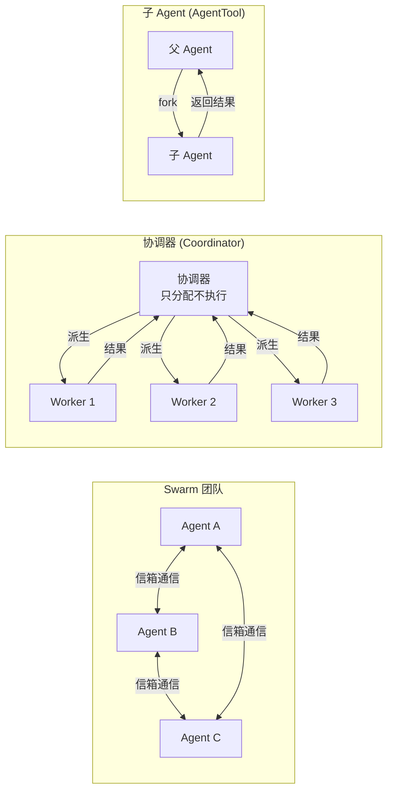

|模式|适用场景|通信方式|特点|
|---|---|---|---|
|**子 Agent**|单个独立子任务|fork-return|最简单，父 Agent 等待结果|
|**协调器**|复杂多步任务|派生 + 综合|协调器不执行，只编排|
|**Swarm 团队**|并行协作任务|命名信箱|Agent 间对等通信|

这三种模式的复杂度递增，但共享同一套底层基础设施 —— `AgentTool` 工具、`ToolUseContext` 上下文隔离和 `<task-notification>` 结果通知

理解子 Agent 模式是理解后两种模式的基础

# 子 Agent 模式（AgentTool）

这是最基础的多 Agent 模式。父 Agent 通过 [[005.工具系统#AgentTool 深度解析|AgentTool]] 派生子 Agent 执行独立任务

关键文件：`src/tools/AgentTool/AgentTool.tsx`

## 完整参数解析

```ts
{
  description: string,           // 3-5 词任务描述（必填）
  prompt: string,                // 完整任务指令（必填）— Worker 从零开始，无对话上下文
  subagent_type?: string,        // 专用 Agent 类型
  model?: 'sonnet' | 'opus' | 'haiku',  // 模型覆盖
  run_in_background?: boolean,   // 异步执行，结果通过 <task-notification> 通知
  name?: string,                 // 可寻址名称（用于 SendMessage）
  isolation?: 'worktree' | 'remote'  // 隔离模式
}
```

**关键设计**：`prompt` 必须是自包含的 —— Worker 无法看到父 Agent 的对话历史。这意味着每个 prompt 都需要包含完成任务所需的全部信息：文件路径、行号、具体的修改内容

为什么采用这种"无上下文"设计而非共享对话历史？原因有三：

1. **隔离性**：子 Agent 不会被父 Agent 对话中无关的信息干扰，上下文更加聚焦
2. **成本控制**：共享完整对话历史会大幅增加每次 API 调用的 token 消耗
3. **并行安全**：多个子 Agent 并行运行时，如果共享可变的对话历史会引发竞态条件

唯一的例外是 Fork 子 Agent（后文详述），它通过精巧的缓存机制在继承完整上下文的同时保持了经济性

## 子 Agent 类型系统

`subagent_type` 决定了 Worker 的工具集、系统提示词和行为约束。Claude Code 源码中定义了三层 Agent 类型：

1. **内建类型**（`src/tools/AgentTool/built-in/`）

这些类型由 Claude Code 核心代码定义，经过精心优化：

| 类型                  | 工具集                              | 模型                  | 系统提示词特点            | 用途     |
| ------------------- | -------------------------------- | ------------------- | ------------------ | ------ |
| **general-purpose** | `['*']`（全部）                      | 默认子 Agent 模型        | 最小化 —— "完成任务，简洁汇报" | 通用任务   |
| **Explore**         | 排除 Agent/Edit/Write/NotebookEdit | 外部用 Haiku（快）；内部继承父级 | 严格只读 + 并行搜索优化      | 代码库探索  |
| **Plan**            | 与 Explore 相同                     | 继承父级模型              | 只读 + 结构化输出要求       | 设计实施方案 |

2. **自定义类型**（`.claude/agents/*.md`）

用户通过 Markdown frontmatter 定义，支持所有 `BaseAgentDefinition` 字段。例如：

```md
---
description: "Database migration specialist"
tools: ["Bash", "Read", "Edit"]
model: "sonnet"
permissionMode: "plan"
---
You are a database migration expert...
```

3. **插件类型**

通过插件系统注入，具有 `source: 'plugin'` 标识

### Explore Agent

Explore Agent 的设计体现了多个精细的工程取舍（`src/tools/AgentTool/built-in/exploreAgent.ts`）：

**系统提示词的"READ-ONLY"硬约束**：提示词开头就用 `=== CRITICAL: READ-ONLY MODE ===` 显式声明禁止列表（不能创建/修改/删除文件、不能用重定向写文件、不能运行改变系统状态的命令）。虽然 `disallowedTools` 已经在工具层面阻止了写入工具，但系统提示词的重复声明是为了在模型层面增加一道安全屏障 —— 模型不会尝试通过 Bash 工具间接写文件

**为什么限制工具集？** 不同任务有不同的安全需求。Explore Agent 只需要读取代码，赋予它写入能力是不必要的风险。类型系统实现了最小权限原则

**Haiku 模型选择**：外部用户使用 Haiku（速度优先），内部用户继承父级模型。这个选择基于 Explore 的任务特性 —— 搜索和读取文件不需要强推理能力，速度更重要。源码中的注释解释了这一点：

```txt
Ants get inherit to use the main agent's model; external users get haiku for speed
model: process.env.USER_TYPE === 'ant' ? 'inherit' : 'haiku',

Ants 继承使用主代理的模型；外部用户获得 haiku 的速度模型：
process.env.USER_TYPE === 'ant' ? '继承' : 'haiku'
```

> [!tip] `process.env.USER_TYPE === 'ant'`
> 
> 指的是 Anthropic 内部员工。`ant` 就是 Anthropic 的缩写
> 
> 这是一个构建时常量（build-time define），在打包时通过 bundler 的 `--define` 注入，而不是运行时设置的。也就是说，外部用户拿到的二进制文件里根本不包含这些 `ant` 专属代码 —— bundler 在编译时就把 `if (process.env.USER_TYPE === 'ant')` 的分支整个删掉了，既不会泄露内部逻辑，也减小了包体积
> 
> 从代码中可以看到，`ant` 用户有很多专属功能和行为：
> 
> - Undercover 模式：Anthropic 员工在公开/开源仓库工作时，自动隐藏内部模型代号、项目名等信息，避免泄露
> - 更多设置选项：比如 ant 用户有 `max` 级别的 effort，外部用户最高只有 `high`
> - 更丰富的遥测：100% 采样率（外部用户只有 0.5%），更详细的 thinking 输出记录等
> - 内部专属功能提前开放：很多新功能对 ant 用户默认开启，外部用户需要等 feature flag 灰度
> - 特殊安全检查：比如禁止 ant 用户在 Docker 外以 `--dangerously-skip-permissions` 运行（防止内部使用时的安全隐患）
> - 邮箱推断：ant 用户可以从 `COO_CREATOR` 环境变量自动拼出 `xxx@anthropic.com` 邮箱

**`omitClaudeMd: true` 的成本优化**：Explore Agent 不需要知道项目的 commit 规范、PR 模板等 `CLAUDE.md` 中的规则 —— 它只读代码，由父 Agent 解读结果。源码注释揭示了这个优化的规模：

```txt
Explore is a fast read-only search agent — it doesn't need commit/PR/lint
rules from CLAUDE.md. The main agent has full context and interprets results.
omitClaudeMd: true,

Explore 是一个快速的只读搜索代理，它不需要 CLAUDE.md 中的 commit/PR/lint 规则。
主代理具有完整的上下文并解释结果。
```

在 34M+ 次 Explore 调用/周的规模下，省略 `CLAUDE.md` 可节省约 5-15G token/周

**并行工具调用的速度提示**：系统提示词末尾特别强调"尽可能并行调用多个工具进行搜索和文件读取" —— 这是利用 API 的并行工具调用能力来加速搜索

### Plan Agent

Plan Agent（`src/tools/AgentTool/built-in/planAgent.ts`）与 Explore 共享只读工具限制，但有不同的设计目标：

**结构化输出要求**：系统提示词要求 Plan Agent 在输出末尾必须包含"Critical Files for Implementation"（实施的关键文件）列表（3-5 个文件）。这不是可选建议 —— 它确保规划结果是可操作的，父 Agent 能根据这些关键文件路径开始执行

**继承父级模型**：与 Explore 使用 Haiku 不同，Plan 使用 `model: 'inherit'`，因为架构设计和方案规划需要更强的推理能力

**工具列表复用**：`tools: EXPLORE_AGENT.tools` —— Plan 直接引用 Explore 的工具定义，确保两者保持一致

### General-purpose Agent

General-purpose Agent（`src/tools/AgentTool/built-in/generalPurposeAgent.ts`）的设计哲学是"最小约束"：

```ts
const SHARED_PREFIX = `You are an agent for Claude Code... Complete the task
  fully—don't gold-plate, but don't leave it half-done.`
// 你是 Claude Code 的 agent……完全完成任务 —— 不要敷衍了事，不要半途而废
```

- `tools: ['*']` 赋予全部工具能力
- 不设置 `omitClaudeMd` —— 因为通用 Agent 可能需要遵守项目的 commit 规范等规则
- 不指定 `model` —— 使用 `getDefaultSubagentModel()` 获取默认子 Agent 模型
- 系统提示词简洁：只要求"完成任务，简洁汇报"

## AgentTool 调用完整流程

当模型发出一次 Agent 工具调用时，系统经历以下 5 个阶段。理解这个流程有助于理解为什么子 Agent 能做到既隔离又高效

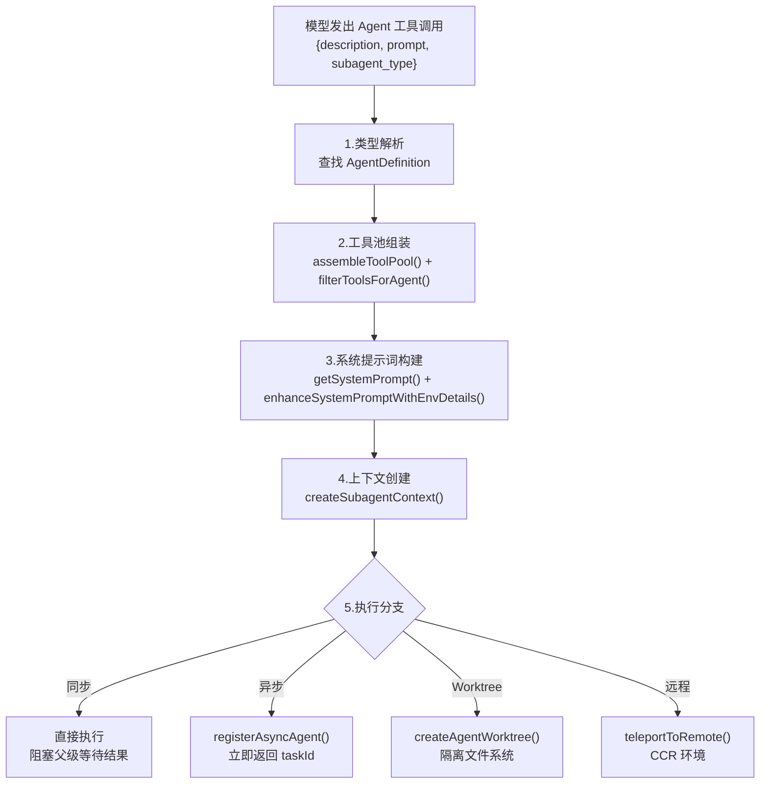

### 1. 类型解析

类型解析的核心逻辑在 `AgentTool.tsx:318-356`：

```ts
// Fork subagent experiment routing:
// - subagent_type set: use it (explicit wins)
// - subagent_type omitted, gate on: fork path (undefined)
// - subagent_type omitted, gate off: default general-purpose
const effectiveType = subagent_type
  ?? (isForkSubagentEnabled() ? undefined : GENERAL_PURPOSE_AGENT.agentType);
const isForkPath = effectiveType === undefined;
```

这段代码的决策逻辑很巧妙：

- **显式指定类型**：直接使用，不猜测
- **省略类型 + fork 实验开启**：走 fork 路径（继承完整上下文）
- **省略类型 + fork 实验关闭**：回退到 general-purpose

如果指定了类型，系统从 `agentDefinitions.activeAgents` 列表中查找匹配的 `AgentDefinition`。找不到时，会区分"不存在"和"被权限拒绝"两种情况，给出不同的错误提示 —— 这对用户调试很有帮助

### 2. 工具池组装

子 Agent 的工具池**独立于父级**构建，这是一个关键的隔离设计（`AgentTool.tsx:568-577`）：

```ts
// Assemble the worker's tool pool independently of the parent's.
// Workers always get their tools from assembleToolPool with their own
// permission mode, so they aren't affected by the parent's tool restrictions.
// 独立于父级工具池组装 worker 的工具池。
// worker 始终使用自己的权限模式从 assemblyToolPool 获取工具，因此不受父级工具限制的影响。
const workerPermissionContext = {
  ...appState.toolPermissionContext,
  mode: selectedAgent.permissionMode ?? 'acceptEdits'
};
const workerTools = assembleToolPool(workerPermissionContext, appState.mcp.tools);
```

注意 `permissionMode` 默认是 `'acceptEdits'` —— 这意味着子 Agent 默认情况下可以自动执行编辑操作，无需逐个确认。这是合理的，因为子 Agent 已经由父 Agent 委托了明确的任务

工具池组装后，还要经过 `filterToolsForAgent()` 的多层过滤（[[#工具过滤流水线]]）

### 3. 系统提示词构建

普通子 Agent 和 Fork 子 Agent 的提示词构建路径完全不同（`AgentTool.tsx:483-541`）：

**普通路径**：

1. 调用 agent 定义的 `getSystemPrompt()` 函数获取基础提示词
2. 用 `enhanceSystemPromptWithEnvDetails()` 追加环境信息（绝对路径格式、平台信息等）
3. 用户的 `prompt` 作为一条独立的 user 消息发送

**Fork 路径**：

1. 直接使用父级已渲染的系统提示词字节（`toolUseContext.renderedSystemPrompt`），不重新计算
2. 用 `buildForkedMessages()` 构建消息序列（克隆父级 assistant 消息 + 占位 tool_result + 子级指令）

Fork 路径为什么不重新计算系统提示词？因为 GrowthBook（A/B 测试系统）的状态可能在父级 turn 开始和 fork 生成之间发生变化，重新计算会产生不同的字节序列，导致 Prompt Cache 失效

[[#Fork 子 Agent]]

### 4. 上下文创建

`createSubagentContext()`（`src/utils/forkedAgent.ts:345-462`）是整个多 Agent 架构的安全基石

[[#上下文隔离深度解析]]

### 5. 执行分支

执行模式的选择逻辑在 `AgentTool.tsx:555-567`：

```ts
const shouldRunAsync = (
  run_in_background === true ||
  selectedAgent.background === true ||
  isCoordinator ||      // 协调器模式下所有 Agent 都异步
  forceAsync ||         // fork 实验开启时所有 Agent 都异步
  assistantForceAsync   // 助手模式下强制异步
) && !isBackgroundTasksDisabled;
```

几个值得注意的设计：

- **协调器模式强制异步**：因为协调器需要同时管理多个 Worker，同步执行会阻塞编排
- **Fork 实验强制异步**：统一使用 `<task-notification>` 交互模型
- **进程内队友不能运行后台 Agent**：生命周期绑定到父级，强制后台会导致孤儿进程

## 工具过滤流水线

子 Agent 的工具不是简单地"给什么用什么" —— 而是经过一条精心设计的四层过滤流水线。这条流水线实现了**纵深防御**：即使某一层有漏洞，其他层仍能拦截危险工具访问

关键函数：`filterToolsForAgent()`（`src/tools/AgentTool/agentToolUtils.ts:70-116`）

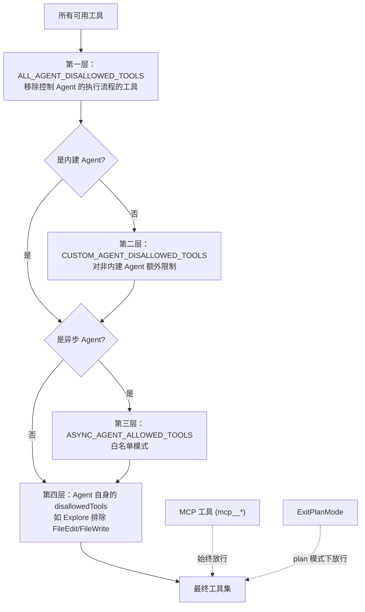

1. **`ALL_AGENT_DISALLOWED_TOOLS`**：
	- 移除"元工具" ——T askOutput、EnterPlanMode、ExitPlanMode、AskUserQuestion、TaskStop 等
	- 这些工具用于控制 Agent 的执行流程本身，子 Agent 不应该能进入 Plan 模式或向用户提问
2. **`CUSTOM_AGENT_DISALLOWED_TOOLS`**：
	- 对用户自定义的 Agent（来自 `.claude/agents/`）施加额外限制
	- 这是一个安全边界 —— 用户定义的 Agent 类型不应该获得与内建类型相同的权限
3. **`ASYNC_AGENT_ALLOWED_TOOLS`**（白名单模式）
	- 异步 Agent 只能使用白名单中的工具（Read、Grep、Glob、Edit、Write、Bash、Skill、NotebookEdit 等）
	- 为什么异步 Agent 需要更严格的限制？因为异步 Agent 在后台运行，无法展示交互式 UI（如权限确认弹窗），某些需要用户交互的工具必须被排除
	- **第三层的
4. **Agent 自身定义的 `disallowedTools`**
	- 例如 Explore Agent 显式排除 `[Agent, ExitPlanMode, FileEdit, FileWrite, NotebookEdit]`

例外：

- **MCP 工具**（名称以 `mcp__` 开头）始终放行
	- 它们由用户配置的外部服务提供，用户对其安全性负责
- **ExitPlanMode**：当 `permissionMode === 'plan'` 时允许：进程内队友需要退出 Plan 模式的能力
	- **进程内队友**：获得额外的 Agent 工具（可以派生同步子 Agent）和任务协调工具（TaskCreate/TaskGet/TaskList/TaskUpdate/SendMessage）：这些工具使队友能够协调共享任务列表和互相通信

**设计洞察**：前三层是全局策略（所有 Agent 都受约束），第四层是类型级策略（特定类型的约束）。这种分层确保了即使有人编写了一个 `disallowedTools: []`（空禁止列表）的自定义 Agent，它仍然受前三层的保护

## 上下文隔离深度解析

`createSubagentContext()`（`src/utils/forkedAgent.ts:345-462`）是多 Agent 架构的安全基石。它为每个子 Agent 创建一个隔离的 `ToolUseContext`，确保子 Agent 的行为不会影响父级

核心设计原则是"**默认隔离，显式共享**"（deny by default）：所有可变状态默认是隔离的，如果需要共享必须通过 `shareSetAppState`、`shareAbortController` 等参数显式 opt-in

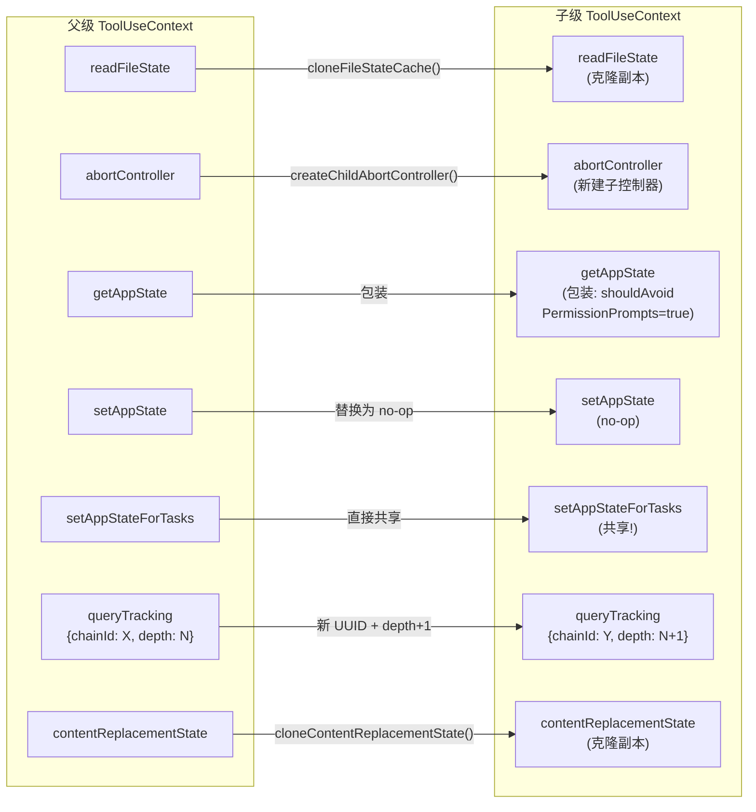

逐项解析每个字段的隔离方式和设计原因：

### readFileState：克隆

```ts
readFileState: cloneFileStateCache(
  overrides?.readFileState ?? parentContext.readFileState,
),
```

文件状态缓存记录了每个文件的最后读取时间和内容哈希。如果子 Agent 与父级共享同一个缓存，子 Agent 的文件读取会改变缓存状态，导致父级对文件新鲜度的判断出错。克隆确保子 Agent 的读取操作不会"污染"父级的缓存

### abortController：新建子控制器

```ts
const abortController = overrides?.abortController ??
  (overrides?.shareAbortController
    ? parentContext.abortController
    : createChildAbortController(parentContext.abortController))
```

`createChildAbortController()` 使用 `WeakRef` 创建一个链接到父级的子控制器。关键行为：

- **父级中断 → 子级也中断**：通过事件监听器传播 abort 信号
- **子级中断 ≠ 父级中断**：子级的 abort 只清理自己的监听器，不影响父级

这个单向传播是故障隔离的基础：一个子 Agent 的失败（被 abort）不会连锁影响父级或其他子 Agent

### getAppState：包装

```ts
getAppState: overrides?.shareAbortController
  ? parentContext.getAppState  // 交互式子 Agent 直接共享
  : () => {
      const state = parentContext.getAppState()
      return {
        ...state,
        toolPermissionContext: {
          ...state.toolPermissionContext,
          shouldAvoidPermissionPrompts: true,  // 关键！
        },
      }
    }
```

非交互式子 Agent（后台运行）的 `getAppState` 被包装为始终返回 `shouldAvoidPermissionPrompts: true`。这防止后台子 Agent 弹出权限确认对话框阻塞父级的终端 —— 后台 Agent 没有地方显示 UI

### setAppState：默认 no-op

```ts
setAppState: overrides?.shareSetAppState
  ? parentContext.setAppState
  : () => {},  // 隔离：子 Agent 的状态变更不传播
```

子 Agent 的状态变更（如工具进度、响应长度）默认不会传播到父级 UI。这避免了多个并行子 Agent 同时更新 UI 导致的混乱

### setAppStateForTasks：始终共享

```ts
// Task registration/kill must always reach the root store, even when
// setAppState is a no-op — otherwise async agents' background bash tasks
// are never registered and never killed (PPID=1 zombie).
// 任务注册/终止必须始终到达根存储，即使setAppState是无操作的 —— 否则异步代理的后台 bash 任务永远不会注册，也永远不会终止（PPID=1 僵尸）
setAppStateForTasks:
  parentContext.setAppStateForTasks ?? parentContext.setAppState,
```

这是唯一一个即使 `setAppState` 是 no-op（无操作）也必须共享的回调。为什么？因为子 Agent 可能通过 Bash 工具启动后台进程。如果这些进程的注册信息到不了根 store，当子 Agent 结束时这些进程就成了僵尸进程 —— PPID=1，无人回收

### queryTracking：新 chainId + depth + 1

```ts
queryTracking: {
  chainId: randomUUID(),           // 每个子 Agent 一个新的链路 ID
  depth: (parentContext.queryTracking?.depth ?? -1) + 1,
}
```

这个字段有两个作用：

1. **防止无限递归**：depth 递增使系统能够检测和限制 Agent 嵌套深度
2. **链路追踪**：chainId 允许分析系统追踪 Agent 的家族谱系，用于性能分析和调试

### contentReplacementState：克隆（非新建）

```ts
// Clone by default (not fresh): cache-sharing forks process parent
// messages containing parent tool_use_ids. A fresh state would see
// them as unseen and make divergent replacement decisions → wire
// prefix differs → cache miss.
contentReplacementState:
  overrides?.contentReplacementState ??
  (parentContext.contentReplacementState
    ? cloneContentReplacementState(parentContext.contentReplacementState)
    : undefined),
```

这个字段的处理方式特别精妙。它管理工具结果中的内容替换（如截断超长输出）

为什么用克隆而不是新建？因为 Fork 子 Agent 会处理包含父级 `tool_use_id` 的消息。如果用一个全新的状态，对同一个 `tool_use_id` 会做出不同的替换决策，导致 API 请求的字节序列不同 —— Prompt Cache 就失效了。克隆确保对已知 ID 做出相同的决策，维持缓存命中

## 四种执行模式

| 模式     | 实现                       | 结果传递                      | 适用场景   |
| ------ | ------------------------ | ------------------------- | ------ |
| **同步** | 进程内直接执行                  | 结果嵌入父对话                   | 简单子任务  |
| **异步** | `LocalAgentTask`         | `<task-notification>` XML | 长时间任务  |
| **队友** | Tmux/iTerm2/InProcess 会话 | 信箱通信                      | 并行协作   |
| **远程** | `RemoteAgentTask`        | WebSocket 流式              | CCR 环境 |

[[#同步 VS. 异步：两条返回路径]]

### 同步模式

是最简单的：

- 父 Agent 阻塞等待子 Agent 完成，结果直接作为 `tool_result` 嵌入父级对话
- 适合快速的探索或搜索任务

### 异步模式

适合长时间运行的任务：

- `registerAsyncAgent()` 在 `AppState.tasks` 中注册任务状态，父 Agent 立即收到一个包含 `agentId` 和 `outputFile` 的响应，可以继续处理其他工作
- 任务完成时，`enqueueAgentNotification()` 将 `<task-notification>` XML 作为 user 角色消息投递到父级的下一轮对话中

**自动后台化**：当同步 Agent 运行超过 120 秒（`getAutoBackgroundMs()`），系统自动将其转为后台任务，避免长时间阻塞父级：

```ts
function getAutoBackgroundMs(): number {
  if (isEnvTruthy(process.env.CLAUDE_AUTO_BACKGROUND_TASKS) ||
      getFeatureValue_CACHED_MAY_BE_STALE('tengu_auto_background_agents', false)) {
    return 120_000;
  }
  return 0;
}
```

### 隔离模式

**Git Worktree 隔离**：子 Agent 在独立的 Git Worktree 中工作，防止多个 Agent 同时修改同一文件：

```ts
主仓库 (main branch)
├── Agent A 在此工作
│
├── .git/worktrees/
│   ├── worktree-abc/     ← Agent B 的隔离副本
│   └── worktree-def/     ← Agent C 的隔离副本
```

Worktree 创建过程（`src/utils/worktree.ts`）：

1. **Slug 验证**：最长 64 字符，只允许字母数字和 `./-/_`，禁止路径穿越（`..`、绝对路径）—— 这是安全边界，防止子 Agent 通过 slug 注入访问仓库外的文件
2. **创建**：在 `.claude/worktrees/<slug>/` 下创建，对大目录（如 `node_modules`）使用符号链接避免磁盘占用
3. **清理**：任务完成后，如果 worktree 无任何文件变更（通过 `git diff` 检测），自动删除；有变更时返回路径和分支名，由用户决定是否合并

### 远程隔离

在远程 CCR（Cross-Continent Runtime）环境中执行，通过 WebSocket 流式传输消息，适用于需要完全隔离的沙盒环境

**远程隔离始终以异步模式运行**

## Fork 子 Agent

当 `subagent_type` 未指定且 `FORK_SUBAGENT` feature gate 启用时，系统创建 **fork 子 Agent** —— 一种特殊模式，继承父级完整对话上下文

```txt
模型调用 Agent({ prompt, subagent_type?, ... })
                    │
                    ▼
          subagent_type 有值吗？
           /              \
         有                没有
          │                 │
          ▼                 ▼
   使用指定的 Agent    FORK_SUBAGENT 开关开了吗？
   （普通子 Agent）     /              \
                     开                关
                      │                 │
                      ▼                 ▼
                Fork 子 Agent     默认用 general-purpose
                                  （普通子 Agent）
```

走 Fork 路径的条件（全部满足）：

1. 模型没有指定 `subagent_type` —— 这是最关键的信号
2. `FORK_SUBAGENT` feature flag 开启 —— 这是编译时的功能开关
3. 不是 Coordinator 模式 —— Coordinator 有自己的任务分发机制
4. 不是非交互式会话 —— 比如 headless/SDK 调用不走 fork
5. 不在 fork 子 Agent 内部 —— 防止递归 fork（fork 里面不能再 fork）

走普通子 Agent 路径的条件（任一满足）：

1. 模型指定了 `subagent_type` —— 显式指定永远优先，比如 `subagent_type: "explore"`
2. `FORK_SUBAGENT` 开关没开 —— 即使没指定 `subagent_type`，也会默认用 `general-purpose`

### 模型什么时候会省略 `subagent_type`？

这取决于 AgentTool 的提示词引导。当 Fork 开关打开时，提示词里会注入一段 `When to fork` 指南，告诉模型：

```ts
  const whenToForkSection = forkEnabled
    ? `
## When to fork
Fork yourself (omit \`subagent_type\`) when the intermediate tool output isn't worth keeping in your context...
- **Research**: fork open-ended questions...
- **Implementation**: prefer to fork implementation work that requires more than a couple of edits...
Forks are cheap because they share your prompt cache...
`
    : ''
```

简单说就是：

| 场景                      | 模型应该...                       | 走哪个路径                        |
| ----------------------- | ----------------------------- | ---------------------------- |
| 开放式研究问题（"这个分支还有什么没完成？"） | 省略 `subagent_type`            | Fork —— 继承上下文，共享缓存           |
| 多个独立问题可以并行              | 省略 `subagent_type`，同时发多个      | Fork —— 并行 fork，缓存共享率最高      |
| 需要多次编辑的实现任务             | 省略 `subagent_type`            | Fork —— 不把中间 tool 输出留在父级上下文  |
| 明确的专项任务（快速搜文件）          | 指定 `subagent_type: "explore"` | 普通 —— explore agent 有专门的只读优化 |
| 需要特定 agent 能力           | 指定 `subagent_type`            | 普通 —— 用对应 agent 的专属提示词       |

核心判断标准是提示词里说的这句话："中间工具输出值不值得留在你的上下文里"。如果不值得（结果太冗长、只需要最终结论），就 fork 出去做，父级上下文保持干净

### 为什么需要 Fork？

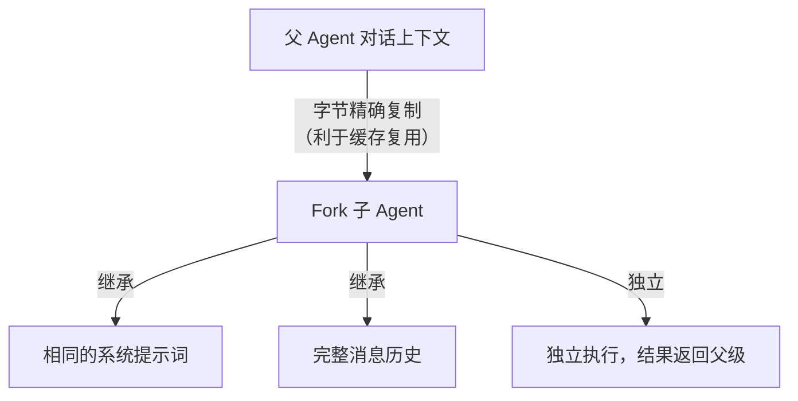

Fork 机制的核心动机是 **Prompt Cache 共享**。理解这一点需要先理解 Anthropic API 的缓存机制：

API 按请求前缀（system prompt + tools + messages prefix）缓存。如果两个请求的前缀字节完全相同，第二个请求可以复用第一个的缓存，cache read token 比 input token 便宜 90%

普通子 Agent 有自己的系统提示词和空的消息历史 —— 它与父级的请求前缀完全不同，无法共享缓存。每次调用都是"冷启动"

Fork 子 Agent 则不同：它**继承父级的完整请求前缀**（相同的系统提示词、相同的工具定义、相同的消息历史），只在末尾追加一条不同的指令。这意味着所有从同一个父级 fork 出来的子 Agent 都共享同一个缓存前缀 —— 第一个 fork 是冷启动，后续的都是缓存命中

源码中 `CacheSafeParams` 类型（`forkedAgent.ts:57-68`）明确了这个"字节级相同"的要求：

```ts
export type CacheSafeParams = {
  /** System prompt - must match parent for cache hits */
  systemPrompt: SystemPrompt
  /** User context - prepended to messages, affects cache */
  userContext: { [k: string]: string }
  /** System context - appended to system prompt, affects cache */
  systemContext: { [k: string]: string }
  /** Tool use context containing tools, model, and other options */
  toolUseContext: ToolUseContext
  /** Parent context messages for prompt cache sharing */
  forkContextMessages: Message[]
}
```

### Fork 消息构建

`buildForkedMessages()`（`forkSubagent.ts:107-169`）是 fork 机制的核心 —— 它构建一组消息，确保所有 fork 子级的请求前缀字节相同。关键实现细节：

1. **克隆父级 assistant 消息**：保留所有内容块（thinking、text、每个 tool_use），不修改 —— 确保字节相同
2. **占位 tool_result**：为每个 tool_use 生成一个 tool_result，文本统一为 `"Fork started — processing in background"`。为什么不用实际结果？因为实际结果各不相同，会破坏缓存前缀的一致性
3. **Per-child directive**：只有最后一个文本块是每个 fork 独有的 —— 包含该 fork 需要执行的具体指令

### 递归 Fork 防护

Fork 子级的工具池中保留了 Agent 工具（为了缓存一致性 —— 如果移除会改变工具定义的字节），但在运行时通过两道防线阻止递归 fork：

```ts
// 第一道：通过 querySource 检测（抗消息压缩）
if (toolUseContext.options.querySource === `agent:builtin:${FORK_AGENT.agentType}`)

// 第二道：扫描消息历史中的 FORK_BOILERPLATE_TAG（后备方案）
|| isInForkChild(toolUseContext.messages)
```

为什么需要两道？

- 首选方案：`querySource` 是在 context 的 options 中设置的，不受消息自动压缩（autocompact）的影响
- 消息扫描是后备方案：覆盖 `querySource` 没有被正确传递的边缘情况

### Fork Agent 定义

```ts
export const FORK_AGENT = {
  agentType: 'fork',
  tools: ['*'],              // 全部工具，保持与父级缓存一致
  maxTurns: 200,
  model: 'inherit',          // 继承父级模型（上下文长度对等）
  permissionMode: 'bubble',  // 权限请求冒泡到父级终端
  getSystemPrompt: () => '', // 未使用——fork 直接使用父级已渲染的系统提示词
}
```

`permissionMode: 'bubble'` 是一个独特的权限模式 —— 当 fork 子级需要权限确认时，请求会"冒泡"到父级的终端显示，而不是被静默拒绝。这是因为 fork 子级被设计为"父级的延伸"，它的操作在概念上仍然由用户控制

`getSystemPrompt: () => ''` 看起来像一个 bug，但实际上是刻意设计 —— fork 路径从不调用这个函数，而是直接传入父级的 `renderedSystemPrompt` 字节。如果不小心调用了它（比如代码路径错误），空字符串会导致明显的异常，而不是一个微妙的缓存失效

**与协调器模式互斥**：Fork 和协调器不能同时启用 —— 协调器有自己的 Worker 委托机制，fork 的"继承完整上下文"设计与协调器的"Worker 从零开始"哲学相矛盾

# 协调器模式（Coordinator）

协调器模式（Feature-gated: `COORDINATOR_MODE`）将主 Agent 转变为**纯编排者** —— 只负责分析任务、分配 Worker、综合结果，永远不直接操作文件

关键文件：`src/coordinator/coordinatorMode.ts`

## 协调器角色定义

协调器的系统提示词由 `getCoordinatorSystemPrompt()` 生成，包含 6 个精心设计的部分：

| 部分                            | 内容                           | 核心约束                                                        | 翻译                      |
| ----------------------------- | ---------------------------- | ----------------------------------------------------------- | ----------------------- |
| 1. **Your Role**              | 定义协调器职责                      | "Direct workers, synthesize results, communicate with user" | 指导员工，综合结果，与用户沟通         |
| 2. **Your Tools**             | Agent, SendMessage, TaskStop | "Do not use workers to trivially report file contents"      | 不要使用 workers 来琐碎地报告文件内容 |
| 3. **Workers**                | Worker 能力和工具集                | subagent_type 必须为 `worker`                                  |                         |
| 4. **Task Workflow**          | 四阶段工作流 + 并发管理                | "Parallelism is your superpower"                            | 并行就是你的超能力               |
| 5. **Writing Worker Prompts** | 提示词编写规范                      | "Never write 'based on your findings'"                      | 永远不要写"基于你的发现"           |
| 6. **Example Session**        | 完整的多轮交互示例                    | 从研究到修复的端到端流程                                                |                         |

## 协调器可用工具

协调器的工具集被严格限制 —— 这是核心设计约束：

|工具|用途|
|---|---|
| `Agent` |派生新 Worker|
| `SendMessage` |继续已有 Worker（利用其加载的上下文）|
| `TaskStop` |终止 Worker（方向错误时的止损）|
| `subscribe_pr_activity` |订阅 GitHub PR 事件（若可用）|

协调器**不能**使用 Bash、Edit、Read 等工具 —— 这确保它只做编排，不做执行。内部工具（TeamCreate, TeamDelete, SendMessage, SyntheticOutput）从主线程中排除

**为什么协调器不能执行？** 这不仅仅是分工问题 —— 如果协调器既做决策又做执行，它会倾向于"自己动手比委托更快"，从而退化为一个普通的单 Agent。工具集的硬限制强制它必须通过 Worker 完成所有实际操作，这保证了任务分配的客观性和并行化

## Worker 工具集

Worker 根据模式获得不同的工具：

```ts
// src/coordinator/coordinatorMode.ts
const workerTools = isEnvTruthy(process.env.CLAUDE_CODE_SIMPLE)
  ? [BASH_TOOL_NAME, FILE_READ_TOOL_NAME, FILE_EDIT_TOOL_NAME]  // 简单模式
  : Array.from(ASYNC_AGENT_ALLOWED_TOOLS)                        // 完整模式
      .filter(name => !INTERNAL_WORKER_TOOLS.has(name))
```

- **简单模式**（`CLAUDE_CODE_SIMPLE`）：Bash, Read, Edit
- **完整模式**：`ASYNC_AGENT_ALLOWED_TOOLS` 中的所有工具（排除内部工具）
- MCP 工具自动可用
- 技能通过 SkillTool 委托

## Worker 工具上下文注入

`getCoordinatorUserContext()` 做了一件看似简单但至关重要的事：它构建一个 `workerToolsContext` 字符串，注入到协调器的用户上下文中。这个字符串告诉协调器：

1. **Worker 有哪些工具**：协调器需要知道 Worker 的能力边界才能写出可行的 prompt（不会要求 Worker 使用它没有的工具）
2. **有哪些 MCP 服务器可用**：如果连接了 Slack MCP，协调器就知道可以派 Worker 发消息
3. **Scratchpad 目录路径**：如果启用了 Scratchpad（草稿本），协调器可以指导 Worker 在共享目录中写入发现

这是**上下文工程在编排层面的体现** —— 协调器不是在盲目委托，而是根据 Worker 的实际能力来制定可行的任务计划

## 标准工作流

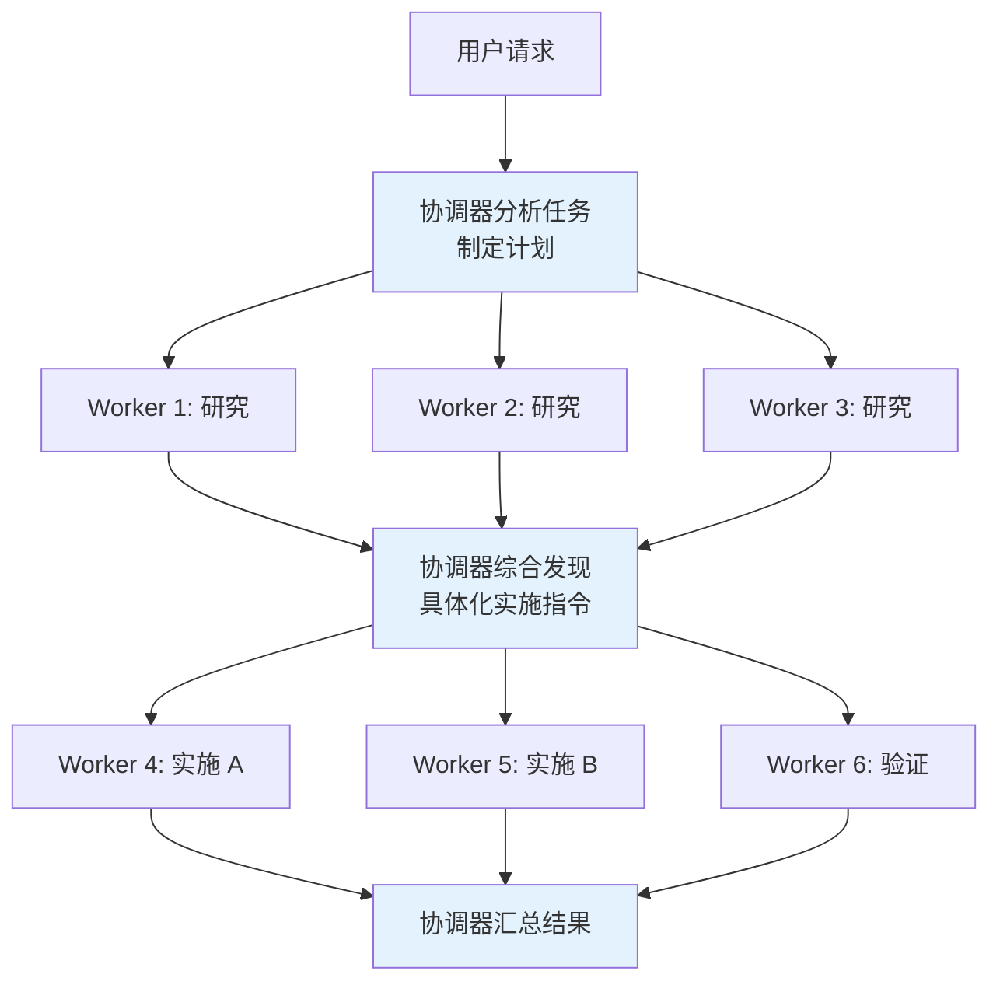

四个阶段的并发管理规则：

|阶段|并发策略|原因|
|---|---|---|
|研究|自由并行|只读操作，无冲突风险|
|综合|协调器串行|必须理解所有发现后才能下发指令|
|实施|按文件集串行|同文件写入必须串行化，防止冲突|
|验证|可与不同文件区域的实施并行|验证不修改被测代码|

## 协调器提示词设计精要

`getCoordinatorSystemPrompt()` 中蕴含了多条经过实践验证的设计原则：

### "Never write 'based on your findings'"

> 永远不要写"基于你的发现"

协调器必须自己理解研究结果，然后写出包含具体文件路径、行号和修改内容的实施指令。"Based on your findings" 是将理解能力委托给 Worker，违背了协调器的核心职责

```ts
// 反模式 — 懒惰委托
Agent({ prompt: "Based on your findings, fix the auth bug" })
// “根据您的发现，修复身份验证错误”

// 正确 — 综合后的具体指令
Agent({ prompt: "Fix the null pointer in src/auth/validate.ts:42.
  The user field on Session is undefined when sessions expire but
  the token remains cached. Add a null check before user.id access." })
// 修复src/auth/validate.ts:42中的空指针。
// 当会话过期但令牌仍然缓存时，会话上的用户字段未定义。在访问user.id之前添加空检查。
```

为什么这条规则如此重要？因为它定义了协调器的**不可委托职责** —— 如果协调器只是转发消息（"Worker A 发现了一些东西，Worker B 你去处理"），它就退化成了一个消息路由器，没有任何智能编排的价值。强制协调器在综合阶段"理解并具体化"，是保持编排质量的关键

### "Every message you send is to the user"

> 你发送的每条信息都是给用户的

这条规则防止协调器在长时间运行时保持沉默。Worker 的 `<task-notification>` 是内部信号，不是对话伙伴 —— 协调器不应该回复通知，而应该向用户报告进展

### "Don't set the model parameter"

> 不要设置模型参数

协调器提示词中明确要求不要为 Worker 设置 `model` 参数。原因是 Worker 默认使用与协调器相同的模型来处理实质性任务。如果协调器为了"节省成本"设置了更便宜的模型，Worker 在复杂实施任务中可能表现不佳 —— 这是一个容易犯的错误

### "Add a purpose statement"

> 添加目的声明

协调器被要求在 Worker prompt 中包含"目的声明" —— 例如"This research will inform a PR description"（这项研究将为 PR 描述提供信息）

这是微妙但重要的提示工程：Worker 知道产出的用途后，会调整输出的深度和格式：

- 为 PR 描述做的研究会更注重用户可见的变化
- 为 bug 修复做的研究会更注重根因分析
- ……

### Continue vs Spawn 决策表

|场景|决策|原因|
|---|---|---|
|研究探索了需要编辑的文件|**Continue**|Worker 已有文件上下文|
|研究范围广但实施范围窄|**Spawn**|避免探索噪声，聚焦上下文更干净|
|纠正失败或扩展最近工作|**Continue**|Worker 有错误上下文|
|验证其他 Worker 刚写的代码|**Spawn**|验证者应以新鲜视角审视|
|上次实施方法完全错误|**Spawn**|错误上下文会锚定重试思路|

最后一条特别有深意：当一个 Worker 的方法完全错误时，它的对话历史中充满了错误的假设和失败的尝试。如果继续使用这个 Worker，模型倾向于基于已有上下文做小修小补（"锚定效应"），而不是从根本上换一种方法。Spawn 一个全新的 Worker 可以避免这种认知锚定

### "验证 = 证明代码有效，不是确认代码存在"

验证 Worker 必须：运行测试（启用功能）、调查类型检查错误（不轻易判定"无关"）、保持怀疑态度、独立测试

### Worker 看不到你的对话

每个 Worker 提示词必须是自包含的。协调器提示词中反复强调这一点："Workers can't see your conversation. Every prompt must be self-contained."（Worker 看不到您的对话。每个提示都必须是独立的）

这是初学者最容易犯的错误 —— 写出类似"请继续刚才的工作"的 prompt，但 Worker 根本不知道"刚才"是什么

# Swarm 执行后端

Swarm 系统支持创建**命名 Agent 团队**，Agent 之间通过信箱对等通信

关键文件：`src/utils/swarm/backends/`

Swarm（蜂群）模式是指一个"领导者"（Leader）Agent 同时协调多个"队友"（Teammate）Agent 并行工作。这些 Teammate 需要一个执行环境来运行，这就是"执行后端"

## 三种后端

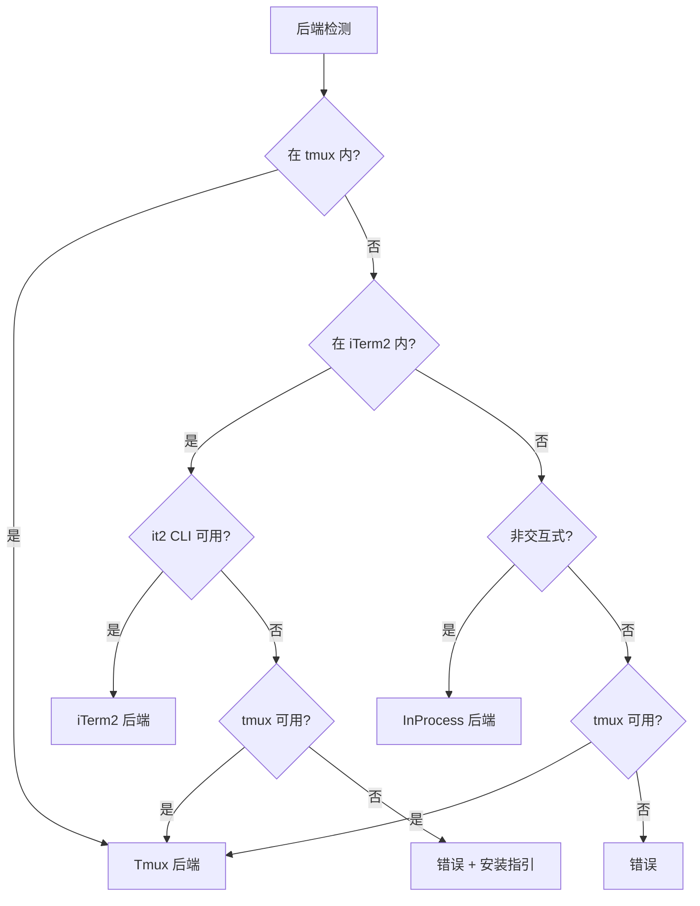

| 后端            | 实现方式                       | 特点                                      | 适用场景                        |
| ------------- | -------------------------- | --------------------------------------- | --------------------------- |
| **Tmux**      | 创建/管理 tmux 分屏面板            | 支持隐藏/显示，最常用                             | 最通用，Linux/macOS/WSL 都能用     |
| **iTerm2**    | 原生 iTerm2 面板（基于 `it2` CLI） | macOS 原生体验                              | macOS + iTerm2 用户           |
| **InProcess** | 同一 Node.js 进程内运行           | AsyncLocalStorage 隔离，共享 API 客户端和 MCP 连接 | 无终端环境（SDK/headless）或没装 tmux |

### Tmux 是什么

Tmux（Terminal Multiplexer） 是一个终端复用器 —— 它可以在一个终端窗口内创建多个虚拟的"面板"（pane），每个面板独立运行一个程序

```txt
┌──────────────────────────────────────────────────────────┐
│ tmux session: claude                                      │
│                                                           │
│ ┌─────────────────────┐ ┌─────────────────────────────┐  │
│ │ Leader (主 Agent)    │ │ Teammate: researcher         │  │
│ │                     │ │                               │  │
│ │ > 正在分析需求...    │ │ > 搜索 API 端点...           │  │
│ │ > 分配任务给队友...  │ │ > 找到 15 个端点              │  │
│ │                     │ │                               │  │
│ ├─────────────────────┤ ├─────────────────────────────┤  │
│ │ Teammate: tester     │ │ Teammate: implementer        │  │
│ │                     │ │                               │  │
│ │ > 运行测试套件...    │ │ > 修改 auth.ts...            │  │
│ │ > 3 failed, 42 pass │ │ > 提交 commit abc1234        │  │
│ └─────────────────────┘ └─────────────────────────────┘  │
└──────────────────────────────────────────────────────────┘
```

在 Swarm 模式下，Claude Code 用 tmux 来：

1. 为每个 Teammate 创建一个 pane —— 用户能同时看到所有 Agent 在干什么
2. 在 pane 中启动独立的 Claude Code 进程 —— 每个 Teammate 是一个独立的 `claude` CLI 实例
3. 设置 pane 边框颜色和标题 —— 每个 Agent 有不同的颜色标识
4. 管理布局 —— 自动调整 pane 大小和排列

### 后端选择优先级的设计考量

后端检测的优先级不是随意排列的，每一步都有明确的理由：

1. **已在 tmux 内 → 直接用 Tmux**：用户已经有了 tmux 分屏基础设施，在 tmux 内再创建新的 tmux session 会造成嵌套混乱。直接利用现有环境最自然
2. **在 iTerm2 内 + `it2` CLI 可用 → 用 iTerm2**：提供 macOS 原生的面板体验（创建/分割窗格而非 tmux 面板），但如果 `it2` CLI 不可用则回退到 tmux —— 因为 iTerm2 环境中 tmux 通常也可用
3. **非交互式环境 → InProcess**：CI/CD、SDK 调用等没有终端的场景，无法创建可视化面板。InProcess 后端在同一进程内运行 Worker，是唯一可行的选择
4. **其他交互式环境 → 尝试 tmux**：如果都不满足，尝试 tmux 作为最后方案。tmux 几乎在所有 Linux/macOS 系统上可用

### Pane 后端 VS. In-Process 后端的区别

| |Pane 后端（Tmux/iTerm 2）|In-Process 后端|
|---|---|---|
|进程模型|每个 Teammate 是独立的 `claude` 进程|所有 Teammate 在同一个 Node.js 进程内|
|可视化|用户能在终端看到每个 Agent 的实时输出|看不到实时输出，只有任务进度通知|
|隔离性|进程级隔离|通过 context 隔离（共享内存）|
|通信|通过文件系统（inbox 消息）|直接在进程内通信|
|适用|交互式终端使用|SDK、headless、没有 tmux 的环境|

## 统一接口

所有后端实现统一的 `TeammateExecutor` 接口：

```ts
interface TeammateExecutor {
  spawn(config): Promise<void>              // 创建队友
  sendMessage(agentId, message): Promise<void>  // 发送消息
  terminate(agentId, reason): Promise<void> // 优雅关闭
  kill(agentId): Promise<void>              // 立即终止
  isActive(agentId): boolean                // 检查存活
}
```

`terminate` 和 `kill` 的区别很重要：

- `terminate` 发送优雅关闭请求（Agent 可以完成当前工作再退出）
- `kill` 通过 AbortController 立即中断

协调器在 Worker 方向错误时使用 `TaskStop`（映射到 `kill`），在正常结束时使用 `terminate`

## InProcess 执行详解

InProcess 后端是最轻量的执行方式，适用于非交互式环境（如 CI/CD）。核心文件：`src/utils/swarm/inProcessRunner.ts`

### AsyncLocalStorage 上下文隔离

每个 Worker 通过 `runWithTeammateContext()` 在独立的 AsyncLocalStorage 上下文中运行。Node.js 的 AsyncLocalStorage 提供了一种在异步调用链中传递上下文的机制 —— 每个 Worker 的异步调用栈（Promise 链、回调等）都能访问自己的 `TeammateIdentity`，即使它们在同一个 Node.js 事件循环中交错执行

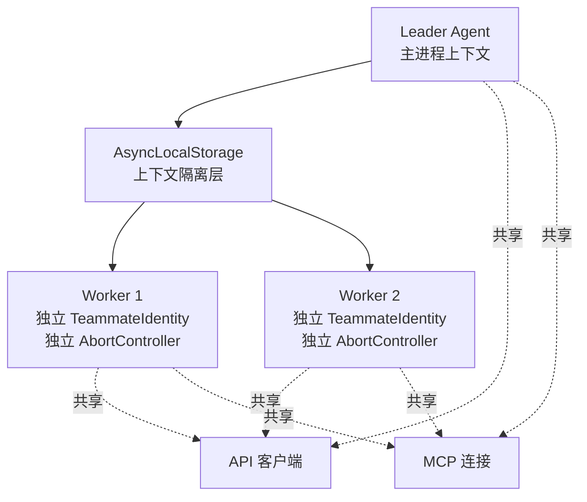

为什么 API 客户端和 MCP 连接可以共享？

- 因为它们本质上是无状态的连接复用 —— HTTP 客户端和 WebSocket 连接是线程安全的，多个 Worker 可以并发使用同一个连接而不会干扰
- 这避免了为每个 Worker 建立独立连接的开销（TCP 握手、TLS 协商、MCP 初始化等）

### 权限同步机制

Worker 执行工具时需要权限审批。InProcess 后端使用两种权限桥接方式：

1. **Leader 桥接**（优先）：Worker 直接调用 Leader 的 `ToolUseConfirm` 对话框，UI 上显示 Worker 标记（badge）让用户知道是哪个 Worker 在请求。这是快速路径 —— 权限确认直接在终端弹出，用户立即看到并做出决策
2. **信箱通信**（后备）：Worker 将权限请求写入信箱（`writeToMailbox`），Leader 通过 `readMailbox` 读取并响应。通过 `registerPermissionCallback()` / `processMailboxPermissionResponse()` 实现。这是当 Leader 桥接不可用时的后备方案 —— 例如 Leader 正忙于处理其他请求

### AbortController 独立性

每个 Worker 有独立的 AbortController。这意味着：

- 一个 Worker 的失败不影响其他 Worker
- 协调器中断不级联到 Worker（Worker 可以被显式 TaskStop）
- `killInProcessTeammate()` 通过 abort controller 立即终止特定 Worker

## Scratchpad：跨 Worker 知识共享

当 `tengu_scratch` feature gate 启用时，系统提供一个共享的 Scratchpad（草稿本）目录：

```ts
// src/coordinator/coordinatorMode.ts
if (scratchpadDir && isScratchpadGateEnabled()) {
  content += `\nScratchpad directory: ${scratchpadDir}\n` +
    `Workers can read and write here without permission prompts. ` +
    `Use this for durable cross-worker knowledge.`
  // 草稿本目录：${scratchpadDir}
  // Workers 可以在这里读写，无需权限提示。
  // 将此用于持久的交叉 Workers 知识
}
```

Workers 可以在这个目录中自由读写文件（无需权限确认），用于持久化跨 Worker 的知识 —— 例如研究发现、中间结果、共享配置

**为什么需要 Scratchpad？** 没有它，Worker 之间只能通过协调器中转信息。这有两个问题：

1. **延迟**：Worker A 的发现必须先回传给协调器，协调器综合后再传给 Worker B —— 多了一个来回
2. **信息丢失**：协调器综合时可能丢失细节（比如具体的行号），Worker B 拿到的是协调器的理解而非原始发现

Scratchpad 提供了一个直接的旁路通道：Worker A 将详细发现写入文件，Worker B 直接读取 —— 无需经过协调器的"理解和转述"

# Coordinator 模式 VS. Swarm 模式

虽然两者表面上都是"一个指挥多个"，但它们的架构层次、交互方式和设计目标完全不同

- Coordinator 模式：主 Agent 自己不动手，只负责拆分任务、分发给 worker、综合结果
- Swarm 模式：主 Agent（Leader）和队友平等协作，Leader 自己也能动手，队友之间也能互相通信

## 详细对比

|                | Coordinator 模式                                                                                       | Swarm 模式                                                 |
| -------------- | ---------------------------------------------------------------------------------------------------- | -------------------------------------------------------- |
| 启用方式           | `CLAUDE_CODE_COORDINATOR_MODE=1` 环境变量                                                                | 模型调用 `TeamCreate` 工具创建团队                                 |
| 系统提示词          | 完全替换为协调器专属提示词                                                                                        | 使用默认提示词 + 追加 teammate 信息                                 |
| Leader 的工具     | 极度精简：只有 `Agent`、`SendMessage`、`TaskStop` 等协调工具                                                       | 完整工具集：Bash、Read、Edit、Agent 等全部可用                         |
| Leader 能否直接写代码 | 不能："Answer questions directly when possible — don't delegate work that you can handle without tools" | 能：Leader 自己也有完整工具，可以亲自干活                                 |
| Worker 的身份     | 通过 `Agent` 工具异步派生，`subagent_type: "worker"`                                                          | 通过 `TeamCreate` + `Agent(name, team_name)` 创建，每个有独立名字和角色 |
| Worker 的生命周期   | 一次性任务或通过 `SendMessage` 追加指令                                                                          | 持久存在的"队友"，有自己的终端面板                                       |
| Worker 间通信     | 不能 — 只能通过 Coordinator 中转                                                                             | 可以 — 队友之间通过 `SendMessage` 直接通信                           |
| 执行后端           | 全部异步（fork/后台 agent）                                                                                  | Tmux pane / iTerm 2 pane / In-Process                    |
| 可视化            | 没有专门的 UI，worker 在后台运行                                                                                | 每个队友有独立的终端面板，实时可见                                        |
| 互斥             | 与 Fork 子 Agent 互斥                                                                                    | 与 Coordinator 不互斥                                        |

## 架构差异图解

Coordinator 模式（中心化星型拓扑）：

```txt
             ┌─────────────────┐
             │   Coordinator   │
             │  (只负责协调)     │
             │  工具: Agent,    │
             │  SendMessage,   │
             │  TaskStop       │
             └───────┬─────────┘
               ╱     │      ╲
             ╱       │        ╲
┌──────────┐  ┌──────────┐  ┌──────────┐
│ Worker 1 │  │ Worker 2 │  │ Worker 3 │
│ (研究)    │  │ (实现)    │  │ (验证)    │
│ 后台运行   │  │ 后台运行   │  │ 后台运行   │
└──────────┘  └──────────┘  └──────────┘
     ↑              ↑              ↑
     └──── 都只向 Coordinator 汇报 ────┘
           Worker 之间不能通信
```

Swarm 模式（去中心化网状拓扑）：

```txt
┌──────────────────────────────────────────────────┐
│ tmux session                                      │
│  ┌────────────┐  ┌────────────┐  ┌────────────┐ │
│  │ Leader     │  │ researcher │  │ tester     │ │
│  │ (有完整工具) │  │ (队友)     │  │ (队友)     │ │
│  │ 可以自己干活 │  │ 独立终端    │  │ 独立终端    │ │
│  └─────┬──────┘  └──────┬─────┘  └──────┬─────┘ │
│        │    ↕           │    ↕           │       │
│        └────────────────┴────────────────┘       │
│            队友之间可以互相发消息                    │
└──────────────────────────────────────────────────┘
```

## Coordinator 的核心设计哲学

从提示词就能看出来，Coordinator 有一套严格的工作流：

```md
You are a **coordinator**. Your job is to:
- Help the user achieve their goal
- Direct workers to research, implement and verify code changes
- Synthesize results and communicate with the user
- Answer questions directly when possible — don't delegate work that you can handle without tools

您是**协调员**。你的工作是：
-帮助用户实现目标
-指导员工研究、实施和验证代码更改
-综合结果并与用户沟通
-尽可能直接回答问题——不要委派那些没有工具就可以处理的工作
```

它强制 Coordinator 遵循一个标准流程：

```txt
Research（研究） → Synthesis（综合） → Implementation（实现） → Verification（验证）
   Worker 做         Coordinator 做       Worker 做              Worker 做
```

其中 Synthesis 是 Coordinator 最重要的职责 —— 它必须理解研究结果，然后写出具体的实现指令（包含文件路径、行号、具体修改内容），而不是简单地"转发"

## Swarm 的核心设计哲学

Swarm 更像一个团队：Leader 创建团队、分配角色，但每个队友是独立的 Claude Code 实例，有自己的上下文、工具、甚至可以操作不同的 git worktree。队友之间可以直接沟通，用户也能在终端面板里直接看到每个队友在做什么

## 什么时候用哪个

| 场景                        | 适合               |
| ------------------------- | ---------------- |
| 大型复杂任务，需要严格的研究→综合→实现→验证流程 | Coordinator      |
| 需要精确控制 worker 的上下文和指令     | Coordinator      |
| 多人协作式任务，队友需要互相交流          | Swarm            |
| 用户想实时看到每个 Agent 的工作状态     | Swarm            |
| 简单的并行任务（几个独立的搜索/修改）       | 两者都行，甚至 Fork 就够了 |

# Worker 结果传递

## 同步 VS. 异步：两条返回路径

Worker 的结果传递分为同步和异步两条路径，它们的机制完全不同：

**同步路径**（`finalizeAgentTool()` in `agentToolUtils.ts`）：

当子 Agent 同步执行时，父 Agent 阻塞等待。完成后，系统提取子 Agent 最后一条 assistant 消息的文本内容（不包含中间的工具调用过程），包装为 `AgentToolResult`，直接作为 `tool_result` 嵌入父级对话

```ts
// 同步结果结构
{
  status: 'completed',
  agentId: string,
  content: [{ type: 'text', text: '最终结果文本' }],
  totalToolUseCount: number,
  totalDurationMs: number,
  totalTokens: number,
}
```

**异步路径**（`enqueueAgentNotification()` in `LocalAgentTask.tsx`）：

异步 Agent 在后台运行，父 Agent 立即收到一个"已启动"的响应。当任务完成（成功/失败/被终止）时，结果以 `<task-notification>` XML 格式作为 **user 角色消息**投递到父级的下一轮对话中：

```ts
<task-notification>
  <task-id>ae9a65ee22594487c</task-id>
  <status>completed</status>
  <summary>Agent "research query engine" completed</summary>
  <result>
    ... 详细结果内容 ...
  </result>
  <usage>
    <total_tokens>71330</total_tokens>
    <tool_uses>21</tool_uses>
    <duration_ms>81748</duration_ms>
  </usage>
</task-notification>
```

关键字段：

- `task-id`：Agent ID，可用于 `SendMessage` 继续该 Worker
- `status`：`completed` / `failed` / `killed`
- `summary`：人类可读的结果摘要（"completed" / "failed: {error}" / "was stopped"）
- `result`：Worker 的文本输出（可选），协调器据此做综合决策
- `usage`：Token 使用量、工具调用次数、耗时 —— 用于成本追踪

**task-notification 以 user 角色消息到达**。协调器通过 `<task-notification>` 开头标签区分它们和真正的用户消息。这个设计选择是因为 Claude API 的消息格式要求 —— 只有 user 角色的消息能由系统注入，而 `<task-notification>` 本质上是一个"系统事件"而非真正的用户输入

## 通知去重与安全检查

**去重机制**：`enqueueAgentNotification()` 使用一个原子 `notified` 标志（`LocalAgentTask.tsx`）防止重复通知。如果 TaskStop 已经标记了任务为已通知，后续的完成通知会被静默丢弃。这防止了一个 Worker 被 stop 后又恰好自然完成时向协调器发送两条通知

**安全分类器**：当 `TRANSCRIPT_CLASSIFIER` feature gate 启用时，`classifyHandoffIfNeeded()`（`agentToolUtils.ts`）在返回子 Agent 结果给父级之前，对子 Agent 的完整对话记录运行安全分类。这是一种**纵深防御**机制 —— 防止攻击者通过精心构造的文件内容（如 README 中嵌入的 prompt injection）利用子 Agent 作为"跳板"，将恶意指令注入父级对话。如果分类器标记了结果，安全警告会被前置到结果文本中

## Worker 生命周期

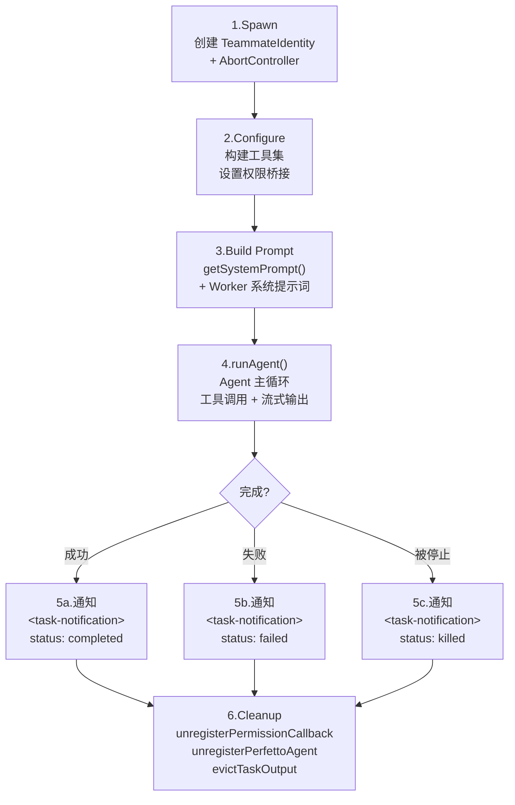

## 错误处理与恢复

Worker 失败时，协调器有多种恢复策略：

|场景|推荐策略|原因|
|---|---|---|
|测试失败| `SendMessage` 继续同一 Worker|Worker 有完整的错误上下文|
|方法完全错误|Spawn 新 Worker|避免错误上下文锚定重试思路|
|Worker 被 TaskStop|可 `SendMessage` 重新定向|被停止的 Worker 可以继续|
|多次纠正失败|报告给用户|可能需要人类判断|

协调器提示词中明确指出处理策略：

```txt
When a worker reports failure:
- Continue the same worker with SendMessage — it has the full error context
- If a correction attempt fails, try a different approach or report to the user

当工人报告失败时：
- 使用 SendMessage 继续同一个工人 —— 它具有完整的错误上下文
- 如果更正尝试失败，请尝试其他方法或向用户报告
```

# Plan 模式：两阶段执行

Plan 模式在 Agent 的工具调用循环中插入了一个**审批关卡** —— 进入 Plan 模式后，系统级剥离写入权限，Agent 只能读取代码和撰写计划文件；用户审批计划后，权限恢复，Agent 按计划执行修改

关键文件：`src/tools/EnterPlanModeTool/`、`src/tools/ExitPlanModeTool/`、`src/utils/planModeV2.ts`、`src/utils/plans.ts`

## 两阶段设计

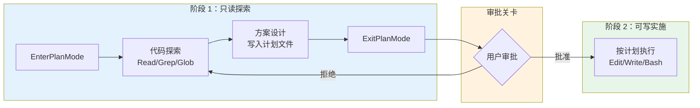

|阶段|权限模式|可写范围|Agent 行为|
|---|---|---|---|
|**探索**|`plan`|仅计划文件|只读工具 + Explore/Plan 子 Agent|
|**实施**|恢复原模式|全部已授权工具|按审批通过的计划执行|

## 权限剥离与恢复

进入 Plan 模式时，系统执行精细的权限管理：

```ts
// src/utils/permissions/permissionSetup.ts
function prepareContextForPlanMode(context: ToolPermissionContext) {
  // 1. 记住进入 Plan 前的权限模式（如 default/auto）
  //    退出时恢复到这个模式
  context.prePlanMode = context.mode

  // 2. 如果从 auto 模式进入，剥离危险权限
  //    防止自动分类器在探索阶段批准写入操作
  if (context.mode === 'auto') {
    stripDangerousPermissionsForAutoMode(context)
  }

  // 3. 切换到 plan 模式
  context.mode = 'plan'
}
```

**被剥离的"危险权限"包括**：Bash 工具级别的 allow 规则、脚本解释器前缀（`python:*`、`node:*` 等）、Agent 通配符（`agent(*)`）。这些权限在用户审批计划后自动恢复

> [!question] 设计决策：为什么不直接禁用所有写入工具？
> 
> Plan 模式保留了一个可写表面 —— 计划文件（存储在 `~/.claude/plans/{slug}.md`）。Agent 需要将探索发现和设计方案持久化到这个文件中，供用户审阅
> 
> 这个"只允许写计划文件"的设计，在安全性（不修改代码）和实用性（能产出可审阅的方案）之间取得了平衡

## Plan 模式的五阶段工作流

系统提示词（`src/utils/messages.ts`）为 Plan 模式定义了一个结构化的工作流：

1. **初步理解**：使用 Explore 子 Agent 调查代码库
2. **方案设计**：使用 Plan 子 Agent 设计实现方案
3. **方案审查**：读取关键文件，确保方案可行
4. **编写计划**：将最终方案写入计划文件（唯一可编辑的文件）
5. **退出 Plan**：调用 ExitPlanMode，触发用户审批

## 审批与状态转换

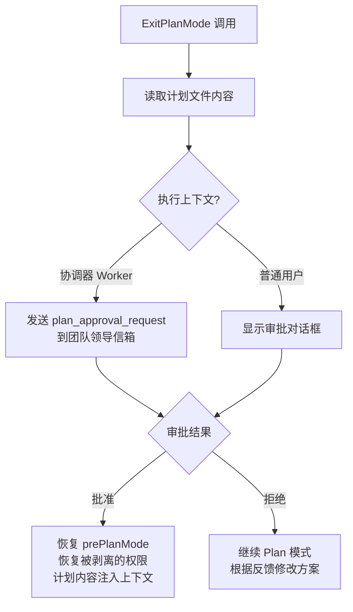

审批通过后，计划内容作为 `tool_result` 注入对话，确保模型在实施阶段能引用具体方案

## 为什么需要两阶段设计？

传统的 Agent 执行模式是"边想边做" —— 模型一边分析问题一边修改代码。这在简单任务中效率很高，但在复杂任务中会导致：

- **方向性返工**：Agent 在只看了局部代码后就动手修改，后续发现整体方向不对，已有修改全部作废
- **无计划的局部修改**：缺少全局视角的逐文件修改可能引入不一致，尤其在大型重构中
- **审批粒度过细**：用户被迫逐个工具调用地审批，无法看到全貌就要做决定

两阶段设计通过一个**审批关卡**强制 Agent "先想清楚再动手"。源码中的关键约束是系统提示词中的这句话：

```txt
The user indicated that they do not want you to execute yet — you MUST NOT make any edits, run any non-readonly tools, or otherwise make any changes to the system.

用户表示他们不希望您执行———您不得进行任何编辑，运行任何非只读工具，或对系统进行任何更改。
```

这不是建议，是硬约束 —— Plan 模式下写入工具的权限被系统级剥离，即使模型尝试调用也会被拒绝

# 设计亮点总结

- **工具过滤实现纵深防御**：四层独立的过滤（全局禁止 → 自定义限制 → 异步白名单 → 类型级禁止）确保即使某一层有 bug，其他层仍能拦截危险工具访问。MCP 工具的"始终放行"看似是例外，实际上是信任边界的正确划分——用户配置的外部工具由用户自己负责安全性
- **上下文隔离默认最大安全**：`createSubagentContext()` 将所有可变状态默认设为隔离（no-op / clone），开发者必须通过 `shareSetAppState`、`shareAbortController` 等参数显式 opt-in 共享。这种"deny by default"设计意味着新增的子 Agent 功能天生是安全的 —— 除非开发者有意识地打开共享
- **Fork 是伪装成架构模式的缓存优化**：Fork 子 Agent 的核心动机不是"继承上下文" —— 而是让多个子级共享父级的 Prompt Cache。`CacheSafeParams` 类型明确要求"字节级相同"就是最好的证据。继承上下文是缓存共享的副产品，不是设计目标
- **协调器不执行是核心约束**：防止协调器既做决策又做执行，保证任务分配的客观性。这也是为什么协调器的工具集被严格限制为 Agent + SendMessage + TaskStop
- **"Never write based on your findings" 是最重要的提示词设计**：强制协调器综合理解研究结果，而非将理解委托给 Worker。这个约束将协调器从消息转发器提升为真正的智能编排者
- **Continue VS. Spawn 不是默认选择**：取决于上下文重叠度。高重叠→继续，低重叠→新建。这个决策框架避免了无脑复用或无脑新建
- **AbortController 独立性保证故障隔离**：一个 Worker 的崩溃不会连锁影响其他 Worker。这是并行系统的基本可靠性要求
- **后端检测优先级考虑用户环境**：tmux > iTerm 2 > InProcess，最大化利用已有终端能力
- **Scratchpad 解决跨 Worker 知识共享**：没有它，Worker 之间只能通过协调器中转信息，增加延迟和信息丢失风险
- **Plan 模式的审批关卡是信任的物化**：两阶段设计不只是 UX 改进 —— 它将"用户信任"从隐性（每次工具调用时的权限弹窗）变为显性（一次性审批整体方案）。这在团队协作中尤为重要：协调器 Worker 的计划需要经过团队领导审批，而不是每个文件修改都需要确认
